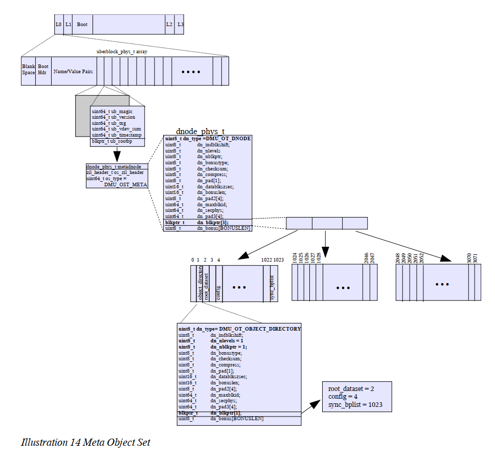
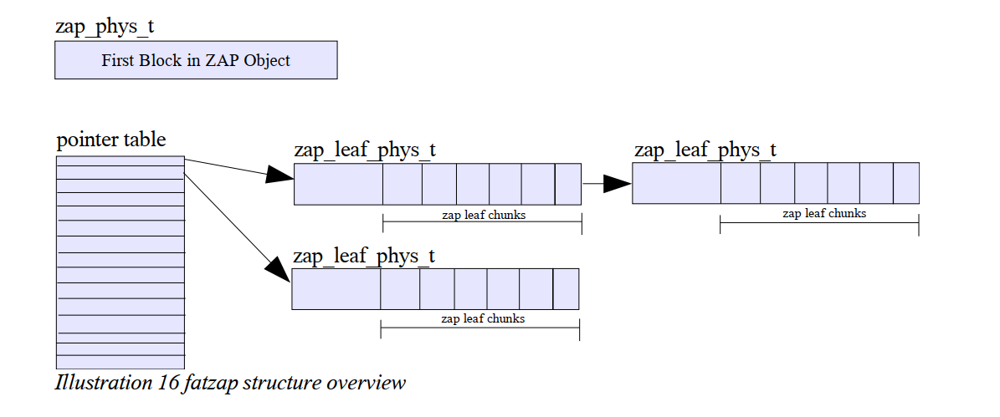

 
Table of Contents
----------------


Introduction	5
Chapter One – Virtual Devices (vdevs), Vdev Labels, and Boot Block	6
Section 1.1: Virtual Devices	6
Section 1.2: Vdev Labels	6
Section 1.2.1: Label Redundancy	7
Section 1.2.2: Transactional Two Staged Label Update	7
Section 1.3: Vdev Technical Details	8
Section 1.3.1: Blank Space	8
Section 1.3.2: Boot Block Header	8
Section 1.3.3: Name-Value Pair List	8
Section 1.3.4: The Uberblock	12
Section 1.4: Boot Block	14
Chapter Two: Block Pointers and Indirect Blocks	15
Section 2.1: DVA – Data Virtual Address	15
Section 2.2 : GRID	16
Section 2.3: GANG	16
Section 2.4: Checksum	17
Section 2.5: Compression	18
Section 2.6 : Block Size	18
Section 2.7: Endian	19
Section 2.8: Type	19
Section 2.9: Level	20
Section 2.10: Fill	20
Section 2.11: Birth Transaction	21
Section 2.12: Padding	21
Chapter Three: Data Management Unit	22
Section 3.1 : Objects	22
Section 3.2: Object Sets	26
Chapter Four – DSL	29
Section 4.1 : DSL Infrastructure	29
Section 4.2: DSL Implementation Details	31
Section 4.3: Dataset Internals	32
Section 4.4: DSL Directory Internals	34
Chapter Five – ZAP	37
Section 5.1: The Micro Zap	38
Section 5.2: The Fat Zap	39
Section 5.2.1: zap_phys_t	39
Section 5.2.2: Pointer Table	41
Section 5.2.3: zap_leaf_phys_t	41
Section 5.2.4 : zap_leaf_chunk	43
Chapter Six – ZPL	45
Section 6.1: ZPL Filesystem Layout	45
Section 6.2: Directories and Directory Traversal	45

Section 6.3: ZFS Access Control Lists	47
 


3
 
Chapter Seven – ZFS Intent Log	51
Section 7.1: ZIL header	51
Section 7.2: ZIL blocks	52

Chapter Eight – ZVOL (ZFS volume)	55
 


 
Introduction
---------------------

ZFS is a new filesystem technology that provides immense巨大的 capacity (128-bit), provable data integrity完整, always-consistent on-disk format, self-optimizing performance自优化性能, and real-time remote replication实时远程复制(能做什么呢？？？).

<span style="border-bottom:2px dashed red;">ZFS departs from traditional filesystems by eliminating the concept of volumes</span>. Instead, ZFS filesystems share a common storage pool consisting of writeable storage media. Media can be added or removed from the pool as filesystem capacity requirements change. Filesystems dynamically grow and shrink as needed without the need to re-partition underlying storage.

ZFS provides a truly consistent on-disk format, but using a copy on write (COW) transaction model. This model ensures that on disk data is never overwritten and all on disk updates are done atomically.

The ZFS software is comprised of seven distinct pieces明显的；独特的: <span style="border-bottom:2px dashed red;">the SPA (Storage Pool Allocator), the DSL (Dataset and Snapshot Layer), the DMU (Data Management Layer层), the ZAP (ZFS Attribute Processor属性处理器), the ZPL (ZFS Posix layer), the ZIL (ZFS Intent Log), and ZVOL (ZFS Volume)</span>. The on-disk structures associated with each of these pieces are explained in the following chapters: SPA (Chapters 1 and 2), DSL (Chapter 5), DMU (Chapter 3), ZAP (Chapter 4), ZPL (Chapter 6), ZIL (Chapter 7), ZVOL (Chapter 8).
 

5
 
# 1. Virtual Devices (vdevs), Vdev Labels, and Boot Block

## 1.1. Section 1.1: Virtual Devices

ZFS storage pools are made up of a collection of virtual devices. There are two types of virtual devices: physical virtual devices (sometimes called leaf vdevs) and logical virtual devices (sometimes called interior vdevs). A physical vdev, is a writeable media block device (a disk, for example). A logical vdev is a conceptual grouping of physical vdevs.

Vdevs are arranged in a tree with physical vdev existing as leaves of the tree（vdev被安排在一个树中，物理vdev作为树的叶子存在.） All pools have a special logical vdev called the “root” vdev which roots the tree. All direct children of the “root” vdev (physical or logical) are called top-level vdevs. The Illustration below shows a tree of vdevs representing a sample pool configuration containing two mirrors. The first mirror (labeled “M1”) contains two disk, represented by “vdev A” and “vdev B”. Likewise, the second mirror “M2” contains two disks represented by “vdev C” and “vdev D”. Vdevs A, B, C, and D are all physical vdevs. “M1” and M2” are logical vdevs; they are also top-level vdevs since they originate from the “root vdev”.


## 1.2. Vdev Labels

Each physical vdev within a storage pool contains a **256KB** structure called a vdev label. The vdev label contains information describing this particular详细说明 physical vdev and all other vdevs which share a common top-level vdev as an ancestor祖先（vdev标签包含描述这个特定的物理vdev和所有其他vdev的信息，这些vdev作为一个祖先共享一个通用的顶级vdev）. For example, the vdev label structure contained on vdev “C”, in the previous illustration, would contain information describing the following vdevs: “C”, “D”, and “M2”. The contents of the vdev label are described in greater detail in section 1.3, Vdev Technical Details.
 

The vdev label serves two purposes: it provides access to a pool's contents and it is used to verify a pool's integrity and availability它提供对池内容的访问，并用于验证池的完整性和可用性. To ensure that the vdev label is always available and always valid, redundancy and a staged update model are used. <span style="border-bottom:2px dashed red;">To provide redundancy, four copies of the label are written to each physical vdev within the pool</span>. The four copies are identical within a vdev, but are not identical across vdevs in the pool. During label updates, a two staged transactional approach is used to ensure that a valid vdev label is always available on disk使用**两阶段事务方法(是什么呢？？？)**来确保在磁盘上始终有有效的vdev标签可用. Vdev label redundancy and the transactional update model are described in more detail below.

### 1.2.1. Section 1.2.1: Label Redundancy冗余

Four copies of the vdev label are written to each physical vdev within a ZFS storage pool. Aside from the small time frame during label update (described below), these four labels are identical and any copy can be used to access and verify the contents of the pool除了标签更新期间的小时间段(如下所述)之外，这四个标签是相同的，可以使用任何副本来访问和验证池的内容. When a device is added to the pool, ZFS places two labels at the front of the device and two labels at the back of the device. The drawing below shows the layout of these labels on a device of size N: L0 and L1 represent the front two labels, L2 and L3 represent the back two labels.


Based on the assumption假定；设想；担任；采取 that corruption贪污，腐败；堕落 (or accidental disk overwrites) typically代表性地 occurs 在连续的块, placing the labels in non-contiguous locations (front and back) provides ZFS with a better probability that some label will remain accessible in the case of media failure or accidental overwrite (eg. using the disk as a swap device while it is still part of a ZFS storage pool).
将标签放置在非连续的位置(前面和后面)为ZFS提供了更好的可能性，即在媒体故障或意外覆盖的情况下，某些标签将保持可访问性(例如。将磁盘用作交换设备，而它仍然是ZFS存储池的一部分)。

### 1.2.2. Section 1.2.2: Transactional Two Staged Label Update

The location of the vdev labels are fixed at the time the device is added to the pool. Thus, the vdev label does not have copy-on-write semantics like everything else in ZFS. Consequently, when a vdev label is updated, the contents of the label are overwritten. Any time on-disk data is overwritten, there is a potential for error. To ensure that ZFS always has access to its labels, a staged approach is used during update. The first stage of the update writes the even labels (L0 and L2) to disk. If, at any point in time, the system comes down or faults during this update, the odd labels will still be valid. Once the even labels have made it out to stable storage, the odd labels (L1 and L3) are updated and written to disk. This approach has been carefully designed to ensure that a valid copy of the label remains on disk at all times.
 


## 1.3. Section 1.3: Vdev Technical Details

The contents of a vdev label are broken up into four pieces: 8KB of blank space, 8K of boot header information, 112KB of name-value pairs, and 128KB of 1K sized uberblock structures. The drawing below shows an expanded view of the L0 label. A detailed description of each components follows: blank space (section 1.3.1), boot block header (section 1.3.2), name/value pair list (section 1.3.3), and uberblock array (section 1.3.4).


**Section 1.3.1: Blank Space**

ZFS supports both VTOC (Volume Table of Contents) and EFI disk labels as valid methods of describing disk layout.1 While EFI labels are not written as part of a slice (they have their own reserved space), VTOC labels must be written to the first 8K of slice 0. Thus, to support VTOC labels, the first 8k of the vdev_label is left empty to prevent 预防，防止；阻止 potentially可能地，潜在地 overwriting a VTOC disk label.

Section 1.3.2: Boot Block Header

The boot block header is an 8K structure that is reserved for future use. The contents of this block will be described in a future appendix附录；阑尾；附加物 of this paper.

Section 1.3.3: Name-Value Pair List

The next 112KB of the label holds a collection of name-value pairs describing this vdev and all of it's related vdevs. Related vdevs are defined as all vdevs within the subtree rooted at this vdev's top-level vdev. For example, the vdev label on device “A” (seen in the illustration插图 below) would contain information describing the subtree highlighted: including vdevs “A”, “B”, and “M1” (top-level vdev).

1	Disk labels describe disk partition and slice information. See fdisk(1M) and/or format(1M) for more information on disk partitions and slices. It should be noted that disk labels are a completely separate entity from vdev labels and while their naming is similar, they should not be confused as being similar.
应该注意的是，磁盘标签是与vdev标签完全独立的实体，虽然它们的命名相似，但不应将它们混淆为相似。
 


All name-value pairs are stored in XDR encoded nvlists**XDR nvlists编码**. For more information on XDR encoding or nvlists, see the libnvpair(3LIB) and nvlist_free(3NVPAIR) man pages. The following name-value pairs are contained within this 112KB portion of the vdev_label.


Version:
Name: “version”
Value: DATA_TYPE_UINT64

Description: On disk format version. Current value is “1”.

Name:
Name: “name”
Value: DATA_TYPE_STRING
Description: Name of the pool in which this vdev belongs.


State:
Name: “state”
Value: DATA_TYPE_UINT64
Description: State of this pool. The following table shows all existing pool states.


State	Value	
POOL_STATE_ACTIVE	0	
POOL_STATE_EXPORTED	1	
POOL_STATE_DESTROYED	2
Table 1 Pool states and values.


Transaction
Name: “txg”
Value: DATA_TYPE_UINT64
Descriptions: Transaction group number in which this label was written to disk.
将此标签写入磁盘的事务组号。


Pool Guid
Name: “pool_guid”
Value: DATA_TYPE_UINT64
Description: Global unique identifier (guid) for the pool.

Top Guid
Name: “top_guid”
Value: DATA_TYPE_UINT64
Description: Global unique identifier for the top-level vdev of this subtree.

Guid
Name: “guid”
Value: DATA_TYPE_UINT64
Description: Global unique identifier for this vdev.

Vdev Tree
Name: “vdev_tree”
Value: DATA_TYPE_NVLIST
Description: The vdev_tree is a nvlist structure which is used recursively递归地 to describe the hierarchical分层的 nature of the vdev tree as seen in illustrations one and four. The vdev_tree recursively describes each “related” vdev within this vdev's subtree. The illustration below shows what the “vdev_tree” entry might look like for “vdev A” as shown in illustrations one and four earlier in this document.


Each vdev_tree nvlist contains the following elements as described in the section below. Note that not all nvlist elements are applicable可适用的 to all vdevs types. Therefore, a vdev_tree nvlist may contain only a subset of the elements described below.vdev_tree nvlist可能只包含下面描述的元素的一个子集。

		```vim
		Name: “type”
		Value: DATA_TYPE_STRING
		Description: String value indicating type of vdev. The following vdev_types are valid.

		Type	      Description
			
		“disk”	      Leaf vdev: block storage
			
		“file”	      Leaf vdev: file storage
			
		“mirror”	  Interior vdev: mirror
			
		“raidz”	      Interior vdev: raidz
			
		“replacing”	  Interior vdev: a slight variation on the
					mirror vdev; used by ZFS when replacing
					one disk with another
			
		“root”     	Interior vdev: the root of the vdev tree
			

		Table 2 Vdev Type Strings

		Name: “id”
		Value: DATA_TYPE_UINT64
		Description: The id is the index of this vdev in its parent's children array.

		Name: “guid”
		Value: DATA_TYPE_UINT64
		Description: Global Unique Identifier for this vdev_tree element.
		


		Name: “path”
		Value: DATA_TYPE_STRING
		Description: Device path. Only used for leaf vdevs.

		Name: “devid”
		Value: DATA_TYPE_STRING
		Description: Device ID for this vdev_tree element. Only used for vdevs of type disk.

		Name: “metaslab_array”
		Value: DATA_TYPE_UINT64
		Description: Object number of an object containing an array of object numbers. Each element of this array (ma[i]) is, in turn, an object number of a space map for metaslab 'i'.

		Name: “metaslab_shift”
		Value: DATA_TYPE_UINT64
		Description: log base 2 of the metaslab size

		Name: “ashift”
		Value: DATA_TYPE_UINT64
		Description: Log base 2 of the minimum allocatable unit for this top level vdev. This is currently '10' for a RAIDz configuration, '9' otherwise.

		Name: “asize”
		Value: DATA_TYPE_UINT64
		Description: Amount of space that can be allocated from this top level vdev

		Name: “children”
		Value: DATA_TYPE_NVLIST_ARRAY
		Description: Array of vdev_tree nvlists for each child of this vdev_tree element.

		```

### 1.3.1. Section 1.3.4: The Uberblock

Immediately following the nvpair lists in the vdev label is an array of uberblocks.紧随vdev标签中的nvpair列表之后的是一个uberblocks数组。 The uberblock is the portion of the label containing information necessary to access the contents of the pool2.uberblock是标签中包含访问pool2内容所需信息的部分。 Only one uberblock in the pool is active at any point in time. The uberblock with the highest transaction group number and valid SHA-256 checksum is the active uberblock.具有最高事务组号和有效SHA-256校验和的uberblock是活动的uberblock。

To ensure constant access to the active uberblock, the active uberblock is never overwritten. Instead, all updates to an uberblock are done by writing a modified uberblock to another element of the uberblock array对uberblock的所有更新都是通过将修改后的uberblock写入uberblock数组的另一个元素来完成的. Upon writing the new uberblock, the transaction group number and timestamps are incremented thereby making it the new active uberblock in a single atomic action在编写新的uberblock时，事务组号和时间戳将增加，从而使它在单个原子动作中成为新的活动uberblock. Uberblocks are written in a round robin fashion across the various vdevs with the pool. The illustration below has an expanded view of two uberblocks within an uberblock array.


**Uberblock Technical Details**
The uberblock is stored in the machine's native endian format本地端字节格式 and has the following contents:

**ub_magic**
The uberblock magic number is a 64 bit integer整数 used to identify a device as containing ZFS data识别包含ZFS数据的设备. The value of the ub_magic is 0x00bab10c (oo-ba-block). The following table shows the ub_magic number as seen on disk.


**ub_version**
The version field is used to identify the on-disk format in which this data is laid out（version字段用于标识数据所在的磁盘格式）. The current on-disk format version number is 0x1. This field contains the same value as the “version” element of the name/value pairs described in section 1.3.3.该字段包含与1.3.3节中描述的名称/值对的“version”元素相同的值

**ub_txg**
All writes in ZFS are done in transaction groups. Each group has an associated transaction group number. The ub_txg value reflects the transaction group in which this uberblock was written. The ub_txg number must be greater than or equal to the “txg” number stored in the nvlist for this label to be valid.
ZFS中的所有写操作都是在事务组中完成的。每个组都有一个关联的事务组号。ub_txg值反映了写入这个uberblock的事务组。ub_txg数字必须大于或等于nvlist中存储的“txg”数字，才能使此标签有效。

**ub_guid_sum**
The ub_guid_sum is used to verify the availability of vdevs within a pool. When a pool is opened, ZFS traverses all leaf vdevs within the pool and totals a running sum of all the GUIDs (a vdev's guid is stored in the guid nvpair entry, see section 1.3.3) it encounters. This computed sum is checked against the ub_guid_sum to verify the availability of all vdevs within this pool.
ub_guid_sum用于验证一个池中vdevs的可用性。当一个池被打开时，ZFS遍历池中所有的叶子vdevs，并对它遇到的所有guid(一个vdev的guid存储在guid nvpair条目中，参见第1.3.3节)的运行和进行汇总。针对ub_guid_sum检查此计算的总和，以验证此池中所有vdevs的可用性。

**ub_timestamp**
Coordinated Universal Time (UTC) when this uberblock was written in seconds since January 1st 1970 (GMT).

**ub_rootbp(这个最重要)**
<span style="border-bottom:2px dashed red;">The ub_rootbp is a blkptr(块指针) structure containing the location of the MOS. Both the MOS and blkptr structures are described in later chapters of this document: Chapters 4 and 2 respectively.


## 1.4. Section 1.4: Boot Block

Immediately following the L0 and L1 labels is a 3.5MB chunk reserved for future use. The contents of this block will be described in a future appendix附录；阑尾；附加物 of this paper.


 

14
 
# 2. Chapter Two: Block Pointers and Indirect(间接块) Blocks

Data is transferred between disk and main memory in units called blocks数据以块的形式在磁盘和主存之间传输. A block pointer (blkptr_t) is a 128 byte ZFS structure used to physically locate, verify, and describe blocks of data on disk.块指针(blkptr_t)是一个128字节的ZFS结构，用于物理定位、验证和描述磁盘上的数据块。

The 128 byte blkptr_t structure layout（布局，结构） is shown in the illustration below.


## 2.1. Section 2.1: DVA – Data Virtual Address

The data virtual address is the name given to the combination of the vdev and offset portions of the block pointer数据虚地址是块指针的vdev和偏移部分的组合, **for example the combination of vdev1 and offset1 make up a DVA (dva1)**. ZFS provides the capability of storing up to three copies of the data pointed to by the block pointerZFS提供了存储由块指针指向的最多三个数据副本的功能, each pointed to by a unique DVA (dva1, dva2, or dva3). The data stored in each of these copies is identical. The number of DVAs used per block pointer is purely a policy decision and is called the “wideness” of the block pointer:
 
single wide block pointer (1 DVA), double wide block pointer (2 DVAs), and triple wide block pointer (3 DVAs).

The vdev portion of each DVA is a 32 bit integer which uniquely identifies the vdev ID containing this block每个DVA的vdev部分是一个32位整数，它惟一地标识包含此块的vdev ID. The offset portion of the DVA is a 63 bit integer value holding the offset (starting after the vdev labels (L0 and L1) and boot block) within that device where the data lives. Together, the vdev and offset uniquely identify the block address of the data it points to.vdev和偏移量一起惟一地标识它所指向的数据块地址

The value stored in offset is the offset in terms of sectors (512 byte blocks)以偏移量存储的值是以扇区为单位的偏移量. To find the physical block byte offset from the beginning of a slice, the value inside offset must be shifted over (<<) by 9 (29 =512) and this value must be added to 0x400000 (size of two vdev_labels and boot block).
**不是很理解上面一段话的意思？？？？**
`physical block address = (offset << 9) + 0x400000 (4MB)`


## 2.2. Section 2.2 : GRID

Raid-Z layout information, reserved for future use.


## 2.3. Section 2.3: GANG

A gang群；一伙；一组 block is a block whose contents contain block pointers一组块是一个块，它的内容包含块指针. Gang blocks are used when the amount of space requested is not available in a contiguous连续的；邻近的；接触的 block当在一个连续块中不能使用所请求的空间量时，使用联合块. In a situation of this kind, several smaller blocks will be allocated (totaling up to the size requested) and a gang block will be created to contain the block pointers for the allocated blocks. A pointer to this gang block is returned to the requester, giving the requester the perception of a single block.
在这种情况下，将分配几个较小的块(总计达到请求的大小)，并创建一个gang块来包含分配块的块指针。指向这个gang块的指针被返回给请求者，给请求者一个单独块的感知

Gang blocks are identified by the “G” bit.


Gang blocks are 512 byte sized, self checksumming blocks组块是512字节大小的自校验和块. A gang block contains up to 3 block pointers followed by a 32 byte checksum一个组块最多包含3个块指针，后跟一个32字节校验和. The format of the gang block is described by the following structures.
 
```C++
typedef struct zio_gbh {
	blkptr_t	zg_blkptr[SPA_GBH_NBLKPTRS];
	uint64_t	zg_filler[SPA_GBH_FILLER];
	zio_block_tail_t  zg_tail.;

} zio_gbh_phys_t;

zg_blkptr: array of block pointers. Each 512 byte gang block can hold up to 3 block pointers.

zg_filler: The filler fields pads out the gang block so that it is nicely byte aligned.

typedef struct zio_block_tail {
	uint64_t zbt_magic;
	zio_cksum_t	zbt_cksum;
}

zbt_magic: ZIO block tail magic number. The value is 0x210da7ab10c7a11 (zio-data-bloc-tail).

typedef zio_cksum {
	uint64_t zc_word[4];

}zio_cksum_t;

zc_word: four 8 byte words containing the checksum for this gang block.
```

## 2.4. Section 2.4: Checksum

By default ZFS checksums all of its data and metadata默认情况下，ZFS检查所有数据和元数据. ZFS supports several algorithms for checksumming including fletcher2, fletcher4 and SHA-256 (256-bit Secure Hash Algorithm in FIPS 180-2, available at http://csrc.nist.gov/cryptval). The algorithm used to checksum this block is identified by the 8 bit integer stored in the cksum portion of the block pointer. The following table pairs each integer with a description and algorithm used to checksum this block's contents.

|Description	|Value	|Algorithm
---|---|---		
on|	1	|fletcher2
off|	2|	none
label|	3|	SHA-256
gang header|	4|	SHA-256		
zilog|	5|	fletcher2		
fletcher2|	6|	fletcher2		
fletcher4|	7|	fletcher4		
SHA-256	|8|	SHA-256
		
Table 5 Checksum Values and associated checksum algorithms.

A 256 bit checksum校验和 of the data is computed for each block using the algorithm identified in cksum使用cksum中的算法为每个块计算256位的数据校验和. If the cksum校验和 value is 2 (off), a checksum will not be computed and _checksum[0], checksum[1], checksum[2], and checksum[3]_ will be zero. Otherwise, the 256 bit checksum computed for this block is stored in the_ checksum[0], checksum[1], checksum[2], and checksum[3]_ fields.

Note: The computed checksum is always of the data, even if this is a gang block. Gang blocks (see above) and zilog blocks (see Chapter 7) are self checksumming.
计算出的校验和总是数据的校验和，即使它是一个组块。组块(见上面)和zilog块(见第7章)是自校验和。

## 2.5. Section 2.5: Compression

ZFS supports several algorithms for compression. The type of compression used to compress this block is stored in the comp portion of the block pointer.

Description	Value	Algorithm
		
on	1	lzjb
		
off	2	none
		
lzjb	3	lzjb
		

Table 6 Compression Values and associated algorithm.


## 2.6. Section 2.6 : Block Size

The size of a block is described by three different fields in the block pointer; psize, lsize, and asize.块的大小由块指针中的三个不同字段描述;psize, lsize，和asize。

lsize: Logical size. The size of the data without compression, raidz or gang overhead.

psize: physical size of the block on disk after compression

asize: allocated size, total size of all blocks allocated to hold this data including any gang headers or raid-Z parity information
：分配的大小，所有分配来保存数据的块的总大小，包括任何组标题或raid-Z奇偶校验信息

If compression is turned off and ZFS is not on Raid-Z storage, lsize, asize, and psize will all be equal.

All sizes are stored as the number of 512 byte sectors (minus one) needed to represent the size of this block.
所有大小都存储为512字节扇区(减1)的数量，该扇区表示此块的大小。

## 2.7. Section 2.7: Endian字节存储次序，元组排列顺序,字节序

ZFS is an adaptive-endian filesystem (providing the restrictions described in Chapter One) that allows for moving pools across machines with different architectures: little endian vs. big endian. The “E” portion of the block pointer indicates which format this block has been written out in. Block are always written out in the machine's native endian format.
ZFS是一个自适应字节序文件系统(提供第一章中描述的限制)，它允许跨具有不同架构的机器移动池:小字节序vs.大字节序。块指针的“E”部分指出这个块是用哪种格式写出来的。块总是以机器的本地端格式写出来。

|Endian|	Value
|---|---	
Little Endian	|1
Big Endian|	0

Table 7 Endian Values

If a pool is moved to a machine with a different endian format, the contents of the block are byte swapped on read.
如果将池移动到具有不同endian格式的机器上，则块的内容在读取时进行字节交换。


## 2.8. Section 2.8: Type

The type portion of the block pointer indicates what type of data this block holds. The type can be the following values. More detail is provided in chapter 3 regarding object types.
块指针的类型部分指示此块持有的数据类型


## 2.9. Section 2.9: Level

The level portion of the block pointer is the number of levels (number of block pointers which need to be traversed to arrive at this data.). See Chapter 3 for a more complete definition of level.
块指针的级别部分是级别的数量(需要遍历的块指针的数量才能到达该数据)。有关级别的更完整定义，请参见第3章。

## 2.10. Section 2.10: Fill

The fill count describes the number of non-zero block pointers under this block pointer. The fill count for a data block pointer is 1, as it does not have any block pointers beneath it.

The fill count is used slightly differently for block pointers of type
DMU_OT_DNODE. For block pointers of this type, the fill count contains the number of free dnodes beneath this block pointer. For more information on dnodes see Chapter 3.


## 2.11. Section 2.11: Birth Transaction

The birth transaction stored in the “birth txg” block pointer field is a 64 bit integer containing the transaction group number in which this block pointer was allocated.


## 2.12. Section 2.12: Padding

The three padding fields in the block pointer are space reserved for future use.
 


21
---------------------------------------------
---------------------------------------------
---------------------------------------------
# 3. Chapter Three: Data Management Unit

The Data Management Unit (DMU) consumes消耗，消费；使…著迷；挥霍 blocks and groups them into logical units called objects数据管理单元(DMU)使用块并将它们分组为称为对象的逻辑单元. Objects can be further grouped by the DMU into object sets. Both objects and object sets are described in this chapter.
通过DMU可以将对象进一步分组为对象集。本章描述了对象和对象集。

## 3.1. Section 3.1 : Objects

With the exception of a small amount of infrastructure described in chapters 1 and 2, everything in ZFS is an object. The following table lists existing ZFS object types; many of these types are described in greater detail in future chapters of this document.
除了在第1章和第2章中描述的少量基础设施之外，ZFS中的所有东西都是对象

Type	                  |Description
---|---|	
DMU_OT_NONE	              |Unallocated object
DMU_OT_OBJECT_DIRECTORY	  |DSL object directory ZAP object
DMU_OT_OBJECT_ARRAY	      |Object used to store an array of object numbers.
DMU_OT_PACKED_NVLIST	  |Packed nvlist object.
DMU_OT_SPACE_MAP	      |SPA disk block usage list.
DMU_OT_INTENT_LOG	      |Intent Log
DMU_OT_DNODE	          |Object of dnodes (metadnode)
DMU_OT_OBJSET	          |Collection of objects.
DMU_OT_DSL_DATASET_CHILD_MAP|DSL ZAP object containing child DSL directory information.
DMU_OT_DSL_OBJSET_SNAP_MAP|	DSL ZAP object containing snapshot information for a dataset.
DMU_OT_DSL_PROPS	      |DSL ZAP properties object containing properties for a DSL dir object.
DMU_OT_BPLIST	          |Block pointer list – used to store the “deadlist” : list of block pointers deleted since the last snapshot, and the “deferred free list” used for sync to convergence.	
DMU_OT_BPLIST_HDR	      |BPLIST header: stores the bplist_phys_t structure.
DMU_OT_ACL	              |ACL (Access Control List) object
DMU_OT_PLAIN_FILE	      |ZPL Plain无格式 file
DMU_OT_DIRECTORY_CONTENTS |ZPL Directory ZAP Object
DMU_OT_MASTER_NODE	      |ZPL Master Node ZAP object: head object used to identify root directory,delete queue, and version for afilesystem.
DMU_OT_DELETE_QUEUE	      |The delete queue provides a list of deletes that were in-progress when the filesystem was force unmounted or as  result of a system failure such as a power outage.  Upon the next mount of the filesystem, the delete queue is processed to remove the files/dirs that are in the delete queue. This mechanism is used to avoid leaking files and directories in the filesystem.	
DMU_OT_ZVOL	              |ZFS  volume (ZVOL)	
DMU_OT_ZVOL_PROP	      |ZVOL properties
	
Table 9 DMU Object Types

<span style="border-bottom:2px dashed red;">Objects are defined by 512 bytes structures called **dnodes3**.</span> A dnode describes and organizes a collection of blocks making up an objectdnode描述并组织组成对象的块的集合. The dnode (dnode_phys_t structure), seen in the illustration below, contains several  确定的；固执的 length fields and two variable length fields. Each of these fields are described in detail below.
 


**dn_type**
An 8-bit numeric value indicating an object's type. See Table 8 for a list of valid object types and their associated 8 bit identifiers.

**dn_indblkshift and dn_datablkszsec**
ZFS supports variable data and indirect (see dn_nlevels below for a description of indirect blocks) block sizes ranging from 512 bytes to 128 Kbytes.

1. **dn_indblkshift**: 8-bit numeric value containing the log (base 2) of the size (in bytes) of an indirect block for this object.

2. **dn_datablkszsec**: 16-bit numeric value containing the data block size (in bytes) divided by 512 (size of a disk sector). This value can range between 1 (for a 512 byte block) and 256 (for a 128 Kbyte block).

**dn_nblkptr and dn_blkptr**
dn_blkptr is a variable length field that can contains between one and three block pointers：dn_blkptr是一个可变长度字段，可以包含一个到三个块指针. The number of block pointers that the dnode contains is set at object allocation time and remains constant throughout the life of the dnode.
dnode包含的块指针的数量是在**对象分配时(怎么个分配法)**设置的，并且在dnode的整个生命周期中保持不变

1. **dn_nblkptr** : 8 bit numeric value containing the number of block pointers in this dnode.
					包含此dnode中的块指针数量的8位数值。
2. **dn_blkptr**: block pointer array containing dn_nblkptr block pointers dn_nlevels
				块指针数组包含dn_nblkptr块指针dn_nlevels

**dn_nlevels** is an 8 bit numeric value containing the number of levels that make up this object. These levels are often referred to as levels of indirection.

- Indirection 间接；迂回；不坦率
A dnode has a limited number (dn_nblkptr, see above) of block pointers to describe an object's datadnode的块指针数量有限(dn_nblkptr，见上)描述一个对象的数据. For a dnode using the largest data block size (128KB) and containing the maximum number of block pointers (3), the largest object size it can represent (without indirection) is 384 KB: 3 x 128KB = 384KB（对于使用最大数据块大小(128KB)并包含最大块指针数(3)的dnode，它可以表示的最大对象大小(没有间接)是384KB: 3 x 128KB = 384KB）. To allow for larger objects, indirect blocks are used. An indirect block is a block containing block pointers间接块是包含块指针的块. The number of block pointers that an indirect block can hold is dependent on the indirect block size (represented by dn_indblkshift) and can be calculated by dividing the indirect  block size by the size of a blkptr (128 bytes)一个间接块可以容纳的块指针的数量取决于间接块大小(由dn_indblkshift表示)，可以通过将间接块大小除以blkptr的大小(128字节)来计算. The largest indirect block  (128KB) can hold up to 1024 block pointers. As an object's size increases, more  indirect blocks and levels of indirection are created. A new level of  indirection is created once an object grows so large that it exceeds the capacity of the current level. ZFS provides up to six levels of indirection to support files up to 264 bytes long.


- The illustration below shows an object with 3 levels of blocks (level 0, level 1, and level 2). This object has triple wide block pointers (dva1, dva2, and dva3) for metadata and single wide block pointers for its data (see Chapter two for a description of block pointer wideness). <span style="border-bottom:2px dashed red;">The blocks at level 0 are data blocks.</span>
 这个对象的元数据有三个宽块指针(dva1、dva2和dva3)，其数据只有一个宽块指针(有关块指针宽度的描述，请参阅第二章)。0级的块是数据块。


**dn_maxblkid**
An object's blocks are identified by block ids. The blocks in each level of indirection are numbered from 0 to N, where the first block at a given level is given an id of 0, the second an id of 1, and so forth.

The dn_maxblkid field in the dnode is set to the value of the largest data (level zero) block id for this object.

Note on Block Ids: Given a block id and level, ZFS can determine the exact branch of indirect blocks which contain the block. This calculation is done using the block id, block level, and number of block pointers in an indirect block. For example, take an object which has 128KB sized indirect blocks. An indirect block of this size can hold 1024 block pointers. Given a level 0 block id of 16360, it can be determined that block 15 (block id 15) of level 1 contains the block pointer for level 0 blkid 16360.

`level 1 blkid = 16360%1024 = 15`

This calculation can be performed recursively up the tree of indirect blocks until the top level of indirection has been reached.
 
**dn_secphys**
The sum of all asize values for all block pointers (data and indirect) for this object.

**dn_bonus, dn_bonuslen, and dn_bonustype**
The bonus buffer (dn_bonus) is defined as the space following a dnode's block pointer array (dn_blkptr). The amount of space is dependent on object type and can range between 64 and 320 bytes.

1. **dn_bonus**: dn_bonuslen sized chunk of data . The format of this data is defined by dn_bonustype.

2. **dn_bonuslen**: Length (in bytes) of the bonus buffer.

3. **dn_bonustype**: 8 bit numeric value identifying the type of data contained within the bonus buffer. The following table shows valid bonus buffer types and the structures which are stored in the bonus buffer. The contents of each of these structures will be discussed later in this specification.


## 3.2. Section 3.2: Object Sets

The DMU organizes objects into groups called object sets. Object sets are used in ZFS to group related objects, such as objects in a filesystem, snapshot, clone, or volume.

Object sets are represented by a 1K byte objset_phys_t structure. Each member of this structure is defined in detail below.


**os_type**
The DMU supports several types of object sets, where each object set type has it's own well defined format/layout for its objects. The object set's type is identified by a 64 bit integer, os_type. The table below lists available DMU object set types and their associated os_type integer value.
DMU支持几种类型的对象集，其中每种对象集类型都有自己定义良好的对象格式/布局

|Object Set Type	|Description	|Value
---|---|---	
DMU_OST_NONE	|Uninitialized Object Set	   |0
DMU_OST_META	|DSL Object Set , See Chapter 4|1
DMU_OST_ZFS	ZPL |Object Set, See Chapter 6	   |2
DMU_OST_ZVOL	|ZVOL Object Set, See Chapter 8|3
		
Table 11 DMU Object Set Types

**os_zil_header**
The ZIL header is described in detail in Chapter 7 of this document.

**metadnode**
As described earlier in this chapter, each object is described by a dnode_phys_t. The collection of dnode_phys_t structures describing the objects in this object set are stored as an object pointed to by the metadnode. The data contained within this object is formatted as an array of dnode_phys_t structures (one for each object within the object set).
描述这个对象集中对象的dnode_phys_t结构的集合被存储为一个由metadnode指向的对象.这个对象中包含的数据被格式化为dnode_phys_t结构的数组(对象集中每个对象一个)。

Each object within an object set is uniquely identified by a 64 bit integer called an object number对象集中的每个对象都由一个称为对象号的64位整数惟一标识. An object's “object number” identifies the array element, in the dnode array, containing this object's dnode_phys_t.

The illustration below shows an object set with the metadnode expanded. The metadnode contains three block pointers, each of which have been expanded to show their contents. Object number 4 has been further expanded to show the details of the dnode_phys_t and the block structure referenced by this dnode.
 


28
---------------------------------------------
---------------------------------------------
--------------------------------------------- 
# 4. Chapter Four – DSL

The DSL (Dataset and Snapshot Layer) provides a mechanism for describing and managing relationships-between and properties-of object sets(DSL(数据集和快照层)提供了一种机制来描述和管理对象集之间和属性之间的关系). Before describing the DSL and the relationships it describes, a brief overview of the various flavors of object sets is necessary.在描述DSL及其描述的关系之前，有必要简要概述一下对象集的各种风格。

**Object Set Overview**
1. ZFS provides the ability to create four kinds of object sets: filesystems, clones, snapshots, and volumes.
2. ZFS filesystem: A filesystem stores and organizes objects in an easily accessible, POSIX compliant manner兼容的方式.
3. ZFS clone: A clone is identical to a filesystem with the exception of its origin. Clones originate from snapshots and their initial contents are identical to that of the snapshot from which it originated.：克隆与文件系统是相同的，只是它的起源不同。克隆源于快照，它们的初始内容与最初的快照相同。
4. ZFS snapshot: A snapshot is a read-only version of a filesystem, clone, or volume at a particular point in time.快照是文件系统、克隆或卷在特定时间点的只读版本。
5. ZFS volume: A volume is a logical volume that is exported by ZFS as a block device.卷是ZFS作为块设备导出的逻辑卷。

ZFS supports several operations and/or configurations which cause interdependencies amongst object sets. The purpose of the DSL is to manage these relationships. The following is a list of such relationships.
：ZFS支持多个操作和/或配置，这些操作和/或配置会导致对象集之间的相互依赖。DSL的目的是管理这些关系。下面是这些关系的列表。

1. Clones: A clone is related to the snapshot from which it originated. Once a clone is created, the snapshot in which it originated can not be deleted unless the clone is also deleted.克隆与它起源的快照相关。一旦创建了克隆，除非也删除克隆，否则无法删除其起源的快照。

2. Snapshots: A snapshot is a point-in-time image of the data in the object set in which it was created. A filesystem, clone, or volume can not be destroyed unless its snapshots are also destroyed.
快照是创建它的对象集中数据的时间点图像。文件系统、克隆或卷不能被破坏，除非它的快照也被破坏

3. Children: ZFS support hierarchically structured object sets; object sets within object sets. A child is dependent on the existence of its parent. A parent can not be destroyed without first destroying all children.


## 4.1. Section 4.1 : DSL Infrastructure

Each object set is represented in the DSL as a dataset. A dataset manages space consumption statistics for an object set, contains object set location information, and keeps track of跟踪 any snapshots inter-dependencies.相互依赖关系
每个对象集在DSL中表示为数据集。数据集管理对象集的空间消耗统计信息，包含对象集位置信息，并跟踪任何快照的相互依赖关系

Datasets are grouped together hierarchically into collections called Dataset Directories.
<span style="border-bottom:2px dashed red;">数据集按层次结构分组到称为数据集目录的集合中

29
 
Dataset Directories manage a related grouping of datasets and the properties associated with that grouping. A DSL directory always has exactly one “active dataset”. All other datasets under the DSL directory are related to the “active” dataset through snapshots, clones, or child/parent dependencies.
数据集目录管理数据集的相关分组和与该分组相关联的属性,DSL目录总是只有一个“活动数据集”。DSL目录下的所有其他数据集都通过快照、克隆或子/父依赖项与“活动”数据集相关  

The following picture shows the DSL infrastructure including a pictorial view of how object set relationships are described via the DSL datasets and DSL directories展示了如何通过DSL数据集和DSL目录描述对象集关系. The top level DSL Directory can be seen at the top/center of this figure. Directly below the DSL Directory is the “active dataset”. The active dataset represents the live filesystem. Originating from the active dataset is a linked list of snapshots which have been taken at different points in time. Each dataset structure points to a DMU Object Set which is the actual object set containing object data. To the left of the top level DSL Directory is a child ZAP4 object containing a listing of all child/parent dependencies. To the right of the DSL directory is a properties ZAP object containing properties for the datasets within this DSL directory. A listing of all properties can be seen in Table 12 below.

A detailed description of Datasets and DSL Directories are described in the Dataset Internals and DSL Directories Internals sections below.


30
 
## 4.2. Section 4.2: DSL Implementation Details

The DSL is implemented as an object set of type DMU_OST_META. This object set is often called the Meta Object Set, or MOS. There is only one MOS per pool and the uberblock (see Chapter One) points to it directly.

There is a single distinguished object in the** Meta Object Set**. This object is called the object directory and is always located in the second element of the dnode array (index 1). All objects, with the exception of the object directory, can be located by traversing through a set of object references starting at this object.
DSL是作为DMU_OST_META类型的对象集实现的。这个对象集通常被称为**元对象集或MOS**。<span style="border-bottom:2px dashed red;">每个池只有一个MOS, uberblock(见第一章)直接指向它。</span>

**The object directory**
The object directory is a ZAP object (an object containing name/value pairs -see chapter 5 for a description of ZAP objects) containing three attribute pairs (name/value) named: root_dataset, config, and sync_bplist.

1. **root_dataset**: The “root_dataset” attribute contains a 64 bit integer value identifying the object number of the root DSL directory for the pool. The root DSL directory is a special object whose contents reference all top level datasets within the pool. The “root_dataset” directory, is an object of type DMU_OT_DSL_DIR and will be explained in greater detail in Section 4.4: DSL Directory Internals.

2. **config**: The “config” attribute contains a 64 bit integer value identifying the object number for an object of type DMU_OT_PACKED_NVLIST. This object contains XDR_ENCODED name value pairs describing this pools vdev configuration. Its contents are similar to those described in section 1.3.3: name/value pairs list.

3. **sync_bplist**: The “sync_bplist” attribute contains a 64 bit integer value
identifying the object number for an object of type
DMU_OT_SYNC_BPLIST. **This object contains a list of block pointers**

which need to be freed during the next transaction.

The illustration below shows the meta object set (MOS) **in relation to the uberblock and label structures** discussed in Chapter 1.
 



## 4.3. Section 4.3: Dataset Internals数据集内部

Datasets are stored as an object of type DMU_OT_DSL_DATASET. <span style="border-bottom:2px dashed red;">This object type uses the bonus buffer in the dnode_phys_t to hold a dsl_dataset_phys_t structure</span>. The contents of the dsl_dataset_phys_t structure are shown below.

**uint64_t ds_dir_obj**: <span style="border-bottom:2px dashed red;">Object number of the DSL directory referencing定位 this dataset.

**uint64_t ds_prev_snap_obj**: If this dataset represents a filesystem, volume, or clone, this field contains the 64 bit object number for the most recent snapshot taken; this field is zero if no snapshots have been taken.
If this dataset represents a snapshot, this field contains the 64 bit object number for the snapshot taken prior to this snapshot. This field is zero if there are no previous snapshots.

**uint64_t ds_prev_snap_txg**: The transaction group number when the previous snapshot (pointed to by ds_prev_snap_obj) was taken.

**uint64_t ds_next_snap_obj**: This field is only used for datasets representing snapshots. It contains the object number of the dataset which is the most recent snapshot. This field is always zero for datasets representing clones, volumes, or filesystems.

**uint64_t ds_snapnames_zapobj**: Object number of a ZAP object (see Chapter 5) containing name value pairs for each snapshot of this dataset. Each pair contains the name of the snapshot and the object number associated with it's DSL dataset structure.

**uint64_t ds_num_children**: Always zero if not a snapshot. For snapshots, this is the number of references to this snapshot: 1 (from the next snapshot taken, or from the active dataset if no snapshots have been taken) + the number of clones originating from this snapshot.

**uint64_t ds_creation_time**: Seconds since January 1st 1970 (GMT) when this dataset was created.

**uint64_t ds_creation_txg**: The transaction group number in which this dataset was created.

**uint64_t ds_deadlist_obj**: The object number of the deadlist (an array of blkptr's deleted since the last snapshot).

**uint64_t ds_used_bytes**: unique bytes used by the object set represented by this dataset

**uint64_t ds_compressed_bytes**: number of compressed bytes in the object set represented by this dataset

**uint64_t ds_uncompressed_bytes**: number of uncompressed bytes in the object set represented by this dataset

**uint64_t ds_unique_bytes**:
When a snapshot is taken, its initial contents are identical to that of the active copy of the data. As the data changes in the active copy, more and more data becomes unique to the snapshot (the data diverges from the snapshot). As that happens, the amount of data unique to the snapshot increases. The amount of unique snapshot data is stored in this field: it is zero for clones, volumes, and filesystems.

**uint64_t ds_fsid_guid**: 64 bit ID that is guaranteed to be unique amongst all
currently open datasets. Note, this ID could change between successive dataset opens.

**uint64_t ds_guid**: 64 bit global id for this dataset. This value never changes during the lifetime of the object set.

**uint64_t ds_restoring**: The field is set to “1” if ZFS is in the process of restoring to this dataset through 'zfs restore'5

**blkptr_t ds_bp**: <span style="border-bottom:2px dashed red;">Block pointer containing the location of the object set that this dataset represents.块指针，包含此数据集表示的对象集的位置。


## 4.4. Section 4.4: DSL Directory InternalsDSL目录内部

The DSL Directory object contains a dsl_dir_phys_t structure in its **bonus buffer**. The contents of this structure are described in detail below.

1. **uint64_t dd_creation_time**: Seconds since January 1st, 1970 (GMT) when this DSL directory was 1. created.

1. **uint64_t dd_head_dataset_obj**: 64 bit object number of the active dataset object
 
1. **uint64_t dd_parent_obj**:64 bit object number of the parent DSL directory
 
1. **uint64_t dd_clone_parent_obj**: For cloned object sets, this field contains the object number 1. of snapshot used to create this clone.

1. **uint64_t dd_child_dir_zapobj**: Object number of a ZAP object containing name-value pairs for 1. each child of this DSL directory.

1. **uint64_t dd_used_bytes**: Number of bytes used by all datasets within this directory: includes any snapshot and child dataset used bytes.

1. **uint64_t dd_compressed_bytes**: Number of compressed bytes for all datasets within this DSL directory.

1. **uint64_t dd_uncompressed_bytes**: Number of uncompressed bytes for all datasets within this DSL directory.

1. **uint64_t dd_quota**: Designated quota, if any, which can not be exceeded by the datasets 1. within this DSL directory.指定配额(如有)，数据集不能超过1。在这个DSL目录中

1. **uint64_t dd_reserved**: The amount of space reserved for consumption by the datasets within this DSL directory.

11. **uint64_t dd_props_zapobj**: 64 bit object number of a ZAP object containing the properties for all datasets within this DSL directory. Only the non-inherited / locally set values are represented in this ZAP object. Default, inherited values are inferred when there is an absence of an entry.

The following table shows valid property values.


 


36
------------------------------------------
------------------------------------------
------------------------------------------ 
# 5. Chapter Five – ZAP

The ZAP (ZFS Attribute Processor) is a module which sits on top of the DMU and operates on objects called ZAP objects. A ZAP object is a DMU object used to store attributes in the form of name-value pairs. The name portion of the attribute is a zero-terminated string of up to 256 bytes (including terminating NULL). The value portion of the attribute is an array of integers whose size is only limited by the size of a ZAP data block.
ZAP (ZFS属性处理器)是一个位于DMU之上的模块，它对称为ZAP对象的对象进行操作.ZAP对象是一个DMU对象，用于以名称-值对的形式存储属性,属性的名称部分是一个以零结尾的最多256字节的字符串(包括终止NULL).属性的值部分是一个整数数组，其大小仅受ZAP数据块的大小限制。

ZAP objects are used to store properties for a dataset, navigate filesystem objects, store pool properties and more. The following table contains a list of ZAP object types.
ZAP对象用于存储数据集的属性、导航文件系统对象、存储池属性等等。下表包含ZAP对象类型的列表。

| ZAP Object Type               |
|-------------------------------|
| DMU\_OT\_OBJECT\_DIRECTORY    |
| DMU\_OT\_DSL\_DIR\_CHILD\_MAP |
| DMU\_OT\_DSL\_DS\_SNAP\_MAP   |
| DMU\_OT\_DSL\_PROPS           |
| DMU\_OT\_DIRECTORY\_CONTENTS  |
| DMU\_OT\_MASTER\_NODE         |
| DMU\_OT\_DELETE\_QUEUE        |
| DMU\_OT\_ZVOL\_PROP           |
Table 13 ZAP Object Types

ZAP objects come in two forms; **microzap objects and fatzap objects**. Microzap objects are a lightweight version of the fatzap and provide a simple and fast lookup mechanism for a small number of attribute entries. The fatzap is better suited for ZAP objects containing large numbers of attributes.
ZAP对象有两种形式;microzap对象和fatzap对象。Microzap对象是fatzap的一个轻量级版本，它为少量属性条目提供了一个简单而快速的查找机制。fatzap更适合于包含大量属性的ZAP对象

The following guidelines are used by ZFS to decide whether or not to use a fatzap or a microzap object.

A microzap object is used if all three conditions below are met:
1. all name-value pair entries fit into one block. The maximum data block size in ZFS is 128KB and this size block can fit up to 2047 microzap entries.
3. The value portion of all attributes are of type uint64_t.
2. The name portion of each attribute is less than or equal to 50 characters in length (including NULL terminating character).

If any of the above conditions are not met, a fatzap object is used.

The first 64 bit word in each block of a ZAP object is used to identify the type of ZAP contents contained within this block. The table below shows these values.
ZAP对象的每个块中的第一个64位单词用于标识该块中包含的ZAP内容的类型。下表显示了这些值。

Identifier	Description	Value
		
| ZBT_MICRO  | This block contains microzap entries  |  (1ULL << 63) + 3   |
|-------------|-------------------|------------------------------
| ZBT_HEADER | This block is used for the fatzap. This identifier is only used for the first block in a fatzap object.              | (1ULL << 63) + 1    |
| ZBT_LEAF   | This block is used for the fatzap\. This identifier is used for all blocks in the fatzap with | the exception of the first. |    (1ULL << 63) + 0 |

Table 14 ZAP Object Block Types

## 5.1. The Micro Zap

The microzap implements a simple mechanism for storing a small number of attributes.  A
microzap object consists of a single block containing an array of microzap entries
microzap实现了一种用于存储少量属性的简单机制。一个microzap对象由一个包含microzap条目（入口）数组的块组成

(mzap_ent_phys_t structures). Each attribute stored in a microzap object is represented by one of these microzap entry structures.
存储在microzap对象中的每个属性都由这些microzap条目结构中的一个表示。

A microzap block is laid out as follows: the first 128 bytes of the block contain a microzap header structure called the mzap_phys_t. This structure contains a 64 bit ZBT_MICRO value indicating that this block is used to store microzap entries. Following this value is a 64 bit salt value that is stirred into the hash so that the hash function is different for each ZAP object. The next 42 bytes of this header is intentionally left blank and the last 64 bytes contain the first microzap entry (a structure of type mzap_ent_phys_t). The remaining bytes in this block are used to store an array of mzap_ent_phys_t structures. The illustration below shows the layout of this block.
 


The mzap_ent_phys_t structure and associated #defines are shown below.

```C++
#define MZAP_ENT_LEN	64
#define MZAP_NAME_LEN	(MZAP_ENT_LEN - 8 – 4 - 2)

typedef struct mzap_ent_phys {
	uint64_t mze_value;
	uint32_t mze_cd;
	uin16_t mze_pad;
	char mze_name[MZAP_NAME_LEN];

} mzap_ent_phys_t;
```

1. **mze_value**: 64 bit integer
2. **mze_cd**: 32 bit collision differentiator (“CD”): associated with an entry whose hash value is the same as another entry within this ZAP object. When an entry is inserted into the ZAP object, the lowest CD which is not already used by an entry with the same hash value is assigned. In the absence of hash collisions, the CD value will be zero.
2. **mze_pad**: reserved for future use
2. **mze_name**: NULL terminated string less than or equal to 50 characters in length

## 5.2. The Fat Zap

The fatzap implements a flexible architecture for storing large numbers of attributes, and/or attributes with long names or complex values (not uint64_t). This section begins with an explanation of the basic structure of a fatzap object and is followed by a detailed explanation of each component of a fatzap object.
fatzap实现了一种灵活的架构，用于存储大量的属性和/或具有长名称或复杂值(而不是uint64_t)的属性。本节首先解释fatzap对象的基本结构，然后详细解释fatzap对象的每个组件。

All entries in a fatzap object are arranged based on a 64 bit hash of the attribute's name. The hash is used to index into a pointer table (as can be seen on the left side of the illustration below). The number of bits used to index into this table (sometimes called the prefix) is dependent on the number of entries in the table. The number of entries in the table can change over time. As policy stands today, the pointer table will grow if the number of entries hashing to a particular bucket exceeds the capacity of one leaf block (explained in detail below). The pointer table entries reference a chain of fatzap blocks called leaf blocks, represented by the zap_leaf_phys structure. Each leaf block is broken up into some number of chunks (zap_leaf_chunks) and each attribute is stored in one or more of these leaf chunks. The illustration below shows the basic fatzap structures, each component is explained in detail in the following sections.




### 5.2.1. zap_phys_t

The first block of a fatzap object contains a 128KB zap_phys_t structure. Depending on the size of the pointer table, this structure may contain the pointer table. If the pointer table is too large to fit in the space provided by the zap_phys_t, some information about where it can be found is store in the zap_table_phys portion of this structure. The definitions of the zap_phys_t contents are as follows:

zap_phys_t
```C++
uint64_t	zap_block_type
uint64_t	zap_magic
struct zap_table_phys {
uint64_t	zt_blk
uint64_t	zt_numblks
uint64_t	zt_shift
uint64_t	zt_nextblk
uint64_t	zt_blk_copied
} zap_ptrtbl;

uint64_t	zap_freeblk
uint64_t	zap_num_leafs
uint64_t	zap_num_entries
uint64_t	zap_salt
uint64_t	zap_pad[8181]

uint64_t	zap_leafs[8192]
```
1. **zap_block_type**:
64 bit integer identifying type of ZAP block. Always set to ZBT_HEADER (see Table 14) for the first block in the fatzap.

2. **zap_magic**:
64 bit integer containing the ZAP magic number: 0x2F52AB2AB (zfs-zap-zap)

3. **zap_table_phys**:
structure whose contents are used to describe the pointer table

	1. **zt_blk**:
	Blkid for the first block of the pointer table. This field is only used when the pointer table is external to the zap_phys_t structure; zero otherwise.

	2. **zt_numblks**:
	Number of blocks used to hold the pointer table. This field is only used when the pointer table is external to the zap_phys_t structure; zero otherwise.

	3. **zt_shift**:
	Number of bits used from the hash value to index into the pointer table. If the pointer table is contained within the zap_phys, this value will be 13.

	4. **uint64_t** zt_nextblk:
	5. **uint64_t** zt_blks_copied:

4. **zap_freeblk**: 64 bit integer containing the first available ZAP block that can be used to allocate a new zap_leaf.

5. **zap_num_leafs**:
Number of zap_leaf_phys_t structures (described below) contained within this ZAP object.

6. **zap_salt**:
The salt value is a 64 bit integer that is stirred into the hash function, so that the hash function is different for each ZAP object.

7. **zap_num_entries**:
Number of attributes stored in this ZAP object.
 

8. **zap_leafs**[8192]:
The zap_leaf array contains 213 (8192) slots. entries, the pointer table will be stored here. If the pointer table has fewer than 213 If not, this field is unused.

 

### 5.2.2.  Pointer Table

The pointer table is a hash table which uses a chaining method to handle collisions. Each hash bucket contains a 64 bit integer which describes the level zero block id (see Chapter 3 for a description of block ids) of the first element in the chain of entries hashed here. An entries hash bucket is determined by using the first few bits of the 64 bit ZAP entry hash computed from the attribute's name. The value used to index into the pointer table is called the prefix and is the zt_shift high order bits of the 64 bit computed hash.


### 5.2.3.  zap_leaf_phys_t

The zap_leaf_phys_t is the structure referenced by the pointer table. Collisions in the pointer table result in zap_leaf_phys_t structures being strung together in a link list fashion. The zap_leaf_phys_t structure contains a header, a hash table, and some number of chunks.

```C++
typedef struct zap_leaf_phys {
	struct zap_leaf_header {
	uint64_t lhr_block_type;
	uint64_t lhr_next;
	uint64_t lhr_prefix;
	uint32_t lhr_magic;
	uint16_t lhr_nfree;
	uint16_t lhr_nentries;
	uint16_t lhr_prefix_len;
	uint16_t lh_freelist;
	uint8_t lh_pad2[12];
} l_hdr; /* 2 24-byte chunks */

uint16_t l_hash[ZAP_LEAF_HASH_NUMENTRIES];
	union zap_leaf_chunk {
	struct zap_leaf_entry {
	uint8_t le_type;
	uint8_t le_int_size;
	uint16_t le_next;
	uint16_t le_name_chunk;
	uint16_t le_name_length;
	uint16_t le_value_chunk;
	uint16_t le_value_length;
	uint16_t le_cd;
	uint8_t le_pad[2];
	uint64_t le_hash;
} l_entry;
	struct zap_leaf_array {
	uint8_t la_type;
	uint8_t la_array[ZAP_LEAF_ARRAY_BYTES];
	uint16_t la_next;
} l_array;
struct zap_leaf_free {
	uint8_t lf_type;
	uint8_t lf_pad[ZAP_LEAF_ARRAY_BYTES];
	uint16_t lf_next;
} l_free;
} l_chunk[ZAP_LEAF_NUMCHUNKS]; } zap_leaf_phys_t;
```

**Header**
The header for the ZAP leaf is stored in a zap_leaf_header structure. It's description is as follows:

1. **lhr_block_type**: always ZBT_LEAF (see Table 14 for values)

2. **lhr_next**: 64 bit integer block id for the next leaf in a block chain.

3. **lhr_prefix and lhr_prefix_len**: Each leaf (or chain of leafs) stores the ZAP entries whose first lhr_prefixlen bits of their hash value equals lhr_prefix. lhr_prefixlen can be equal to or less than zt_shift (the number of bits used to index into the pointer table) in which case multiple pointer table buckets reference the same leaf.

4. **lhr_magic**: leaf magic number == 0x2AB1EAF (zap-leaf)

5. **lhr_nfree**: number of free chunks in this leaf (chunks described below)

6. **lhr_nentries**: number of ZAP entries stored in this leaf

7. lhr_**freelist**: head of a list of free chunks, 16 bit integer used to index into the zap_leaf_chunk array

8. **Leaf Hash**
The next 8KB of the zap_leaf_phys_t is the zap leaf hash table. The entries in the has table reference chunks of type zap_leaf_entry. Twelve bits (the twelve following the lhr_prefix_len used to uniquely identify this block) of the attribute's hash value are used to index into the this table. Hash table collisions are handled by chaining entries. Each bucket in the table contains a 16 bit integer which is the index into the zap_leaf_chunk array.


### 5.2.4.  zap_leaf_chunk

Each leaf contains an array of chunks. There are three types of chunks: zap_leaf_entry, zap_leaf_array, and zap_leaf_free. Each attribute is represented by some number of these chunks: one zap_leaf_entry and some number of zap_leaf_array chunks. The illustration below shows how these chunks are arranged. A detailed description of each chunk type follows the illustration.
 


**zap_leaf_entry**: The leaf hash table (described above) points to chucks of this type. This entry contains pointers to chunks of type zap_leaf_array which hold the name and value for the attributes being stored here.

1. **le_type**: ZAP_LEAF_ENTRY == 252

2. **le_int_size**: Size of integers in bytes for this entry.

3. **le_next**: Next entry in the zap_leaf_chunk chain. Chains occur when there are collisions in the hash table. The end of the chain is designated by a le_next value of 0xffff.

4. **le_name_chunk**: 16 bit integer identifying the chunk of type
 
5. **zap_leaf_array** which contains the first 21 characters of this attribute's name.

6. **le_name_length**: The length of the attribute's name, including the NULL character.

7. **le_value_chunk**:16 bit integer identifying the first chunk (type zap_leaf_array) containing the first 21 bytes of the attribute's value.

8. **le_value_length**: The length, in integer increments (le_int_size)

9. **le_cd**: The collision differentiator (“CD”) is a value associated with an entry whose hash value is the same as another entry within this ZAP object. When an entry is inserted into the ZAP object, the lowest CD which is not already used by an entry with the same hash value is assigned. In the absence of hash collisions, the CD value will be zero.

10. **le_hash**: 64 bit hash of this attribute's name.

**zap_leaf_array**: Chunks of the zap_leaf_array hold either the name or the value of the ZAP attribute. These chunks can be strung together to provide for long names or large values. zap_leaf_array chunks are pointed to by a zap_leaf_entry chunk.

1. **la_type**: ZAP_LEAF_ARRAY == 251

2. **la_array**: 21 byte array containing the name or value's
value. Values of type “integer” are always stored in big endian format, regardless of the machine's native endianness.

3. **la_next**: 16 bit integer used to index into the zap_leaf_chunk array and references the next zap_leaf_array chunk for this attribute; a value of 0xffff (CHAIN_END) is used to designate the end of the chain

4. **zap_leaf_free**: Unused chunks are kept in a chained free list. The root of the free list is stored in the leaf header.

5. **lf_type**: ZAP_LEAF_FREE == 253

6. **lf_next**: 16 bit integer pointing to the next free chunk.
 


44
--------------------------------------
--------------------------------------
-------------------------------------- 
# 6. Chapter Six – ZPL

<span style="border-bottom:2px dashed red;">The ZPL, ZFS POSIX Layer, makes DMU objects look like a POSIX filesystem</span>. POSIX is a standard defining the set of services a filesystem must provide. ZFS filesystems provide all of these required services.

The ZPL represents filesystems as an object set of type DMU_OST_ZFS(ZPL将文件系统表示为DMU_OST_ZFS类型的对象集). All snapshots, clones and filesystems are implemented as an object set of this type. The ZPL uses a well defined format for organizing objects in its object set. The section below describes this layout.
ZPL使用一种定义良好的格式来组织其对象集中的对象。下面的部分将介绍这种布局

## 6.1. Section 6.1: ZPL Filesystem Layout

A ZPL object set has one object with a fixed location and fixed object number一个ZPL对象集有一个具有**固定位置**和**固定对象编号**的对象. This object is called the “master node” and always has an object number of 1. The master node is a ZAP object containing three attributes: DELETE_QUEUE, VERSION, and ROOT.
这个对象称为“主节点”，对象号总是为1。主节点是一个ZAP对象，包含三个属性:DELETE_QUEUE、VERSION和ROOT。

1. Name: **DELETE_QUEUE**
Value: 64 bit object number for the delete queue object
Description: The delete queue provides a list of deletes that were in-progress when the filesystem was force unmounted or as a result of a system failure such as a power outage. Upon the next mount of the filesystem, the delete queue is processed to remove the files/dirs that are in the delete queue. This mechanism is used to avoid leaking files and directories in the filesystem.
删除队列提供了一个删除列表，这些删除是在强制卸载文件系统时或由于系统故障(如停电)而进行的,在文件系统的下一次挂载时，将处理删除队列以删除删除队列中的文件/dirs。此机制用于避免文件系统中的文件和目录泄漏

2. Name: **VERSION**
Value: Currently a value of “1”.
Description: ZPL version used to lay out this filesystem.

3. Name: **ROOT**
Value: 64 bit object number
Description: This attribute's value contains the object number for the top level directory in this filesystem, the root directory.此属性的值包含此文件系统中顶层目录(即根目录)的对象号。


## 6.2. Section 6.2: Directories and Directory Traversal目录和目录遍历

Filesystem directories are implemented as ZAP objects (object type
DMU_OT_DIRECTORY)文件系统目录被实现为ZAP对象(对象类型)
DMU_OT_DIRECTORY). Each directory holds a set of name-value pairs which contain the names and object numbers for each directory entry每个目录拥有一组名称-值对，其中包含每个目录条目的名称和对象编号. Traversing through a directory tree is as simple as looking up the value for an entry and reading that object number.遍历目录树与查找条目的值并读取对象编号一样简单

All filesystem objects contain a znode_phys_t structure in the bonus buffer of it's dnode. This structure stores the attributes属性 for the filesystem object. The znode_phys_t structure is shown below.

```C++
typedef struct znode_phys {
	uint64_t zp_atime[2];
	uint64_t zp_mtime[2];
	uint64_t zp_ctime[2];
	uint64_t zp_crtime[2];
	uint64_t zp_gen;
	uint64_t zp_mode;
	uint64_t zp_size;
	uint64_t zp_parent;
	uint64_t zp_links;
	uint64_t zp_xattr;
	uint64_t zp_rdev;
	uint64_t zp_flags;
	uint64_t zp_uid;
	uint64_t zp_gid;
	uint64_t zp_pad[4];
	zfs_znode_acl_t zp_acl;
} znode_phys_t
```

1. **zp_atime**: Two 64 bit integers containing the last file access time in seconds (zp_atime[0]) and nanoseconds (zp_atime[1]) since January 1st 1970 (GMT).

2. **zp_mtime**: Two 64 bit integers containing the last file modification time in seconds (zp_mtime[0]) and nanoseconds (zp_mtime[0]) since January 1st 1970 (GMT).

3. **zp_ctim**e: Two 64 bit integers containing the last file change time in seconds (zp_ctime[0]) and nanoseconds (zp_ctime[1]) since January 1st 1970 (GMT).

4. z**p_crtime**: Two 64 bit integers containing the file's creation time in seconds (zp_crtime[0]) and nanoseconds (zp_crtime[1]) since January 1st 1970 (GMT).

5. **zp_gen**: 64 bit generation number, contains the transaction group number of the creation of this file.

6. **zp_mode**: 64 bit integer containing file mode bits and file type. The lower 8 bits of the mode contain the access mode bits, for example 755. The 9th bit is the sticky bit and can be a value of zero or one. Bits 13-16 are used to designate the file type. The file types can be seen in the table below.
 包含文件模式位和文件类型的64位整数。模式的下8位包含访问模式位，例如755。第9位是粘性位，可以是0或1的值。第13-16位用于指定文件类型。文件类型可以在下表中看到


| Type      | Description              | Value in bits 13\-16 |
|-----------|--------------------------|----------------------|
|           |                          |                      |
| S\_IFIFO  | Fifo                     | 0x1                  |
|           |                          |                      |
| S\_IFCHR  | Character Special Device | 0x2                  |
|           |                          |                      |
| S\_IFDIR  | Directory                | 0x4                  |
|           |                          |                      |
| S\_IFBLK  | Block special device     | 0x6                  |
|           |                          |                      |
| S\_IFREG  | Regular file             | 0x8                  |
|           |                          |                      |
| S\_IFLNK  | Symbolic Link            | 0xA                  |
|           |                          |                      |
| S\_IFSOCK | Socket                   | 0xC                  |
|           |                          |                      |
| S\_IFDOOR | Door                     | 0xD                  |
|           |                          |                      |
| S\_IFPORT | Event Port               | 0xE                  |

Table 15 File Types and their associated mode bits

1. **zp_size**: size of file in bytes
2. **zp_parent**: object id of the parent directory containing this file
3. **zp_links**: number of hard links to this file
4. **zp_xattr**: object ID of a ZAP object which is the hidden attribute directory. It is treated like a normal directory in ZFS, except that its hidden and an application will need to "tunnel" into the file via openat() to get to it.
5. **zp_rdev**: dev_t for files of type S_IFCHR or S_IFBLK
6. **zp_flags**: Persistent flags set on the file.  The following are valid flag values.

| Flag              | Value |
|-------------------|-------|
| ZFS_XATTR        | 0x1   |
| ZFS_INHERIT\_ACE | 0x2   |

Table 16 zp_flag values

1. **zp_uid**: 64 bit integer (uid_t) of the files owner.
2. **zp_gid**: 64 bit integer (gid_t) owning group of the file.
3. **zp_acl**: zfs_znode_acl structure containing any ACL entries set on this file. The zfs_znode_acl structure is defined below.


## 6.3. Section 6.3: ZFS Access Control Lists

Access control lists (ACL) serve as a mechanism to allow or restrict user access privileges on a ZFS object. ACLs are implemented in ZFS as a table containing ACEs (Access Control Entries).
访问控制列表(ACL)是一种允许或限制ZFS对象上的用户访问权限的机制。acl在ZFS中实现为一个包含ACEs(访问控制项)的表。

The znode_phys_t contains a zfs_znode_acl structure. This structure is shown below.

```C++
#define ACE_SLOT_CNT	6

typedef struct zfs_znode_acl {
uint64_t	z_acl_extern_obj;
uint32_t	z_acl_count;
uint16_t	z_acl_version;
uint16_t	z_acl_pad;
ace_t	z_ace_data[ACE_SLOT_CNT];

} zfs_znode_acl_t;
```

1. **z_acl_extern_obj**: Used for holding ACLs that won't fit in the znode. In other words, its for ACLs great than 6 ACEs. The object type of an extern ACL is DMU_OT_ACL.
2. **z_acl_count**: number of ACE entries that make up an ACL
3. **z_acl_version**: reserved for future use.
4. **z_acl_pad**: reserved for future use.
5. **z_ace_data**: Array of up to 6 ACEs.

An ACE specifies an access right to an individual user or group for a specific object.

```C++
typedef struct ace {
uid_t	a_who;
uint32_t	a_access_mask;
uint16_t	a_flags;
uint16_t	a_type;

} ace_t;
```

a_who: This field is only meaningful when the ACE_OWNER, ACE_GROUP and

ACE_EVERYONE flags (set in a_flags, described below) are not asserted. The

1. **a_who** field contains a UID or GID. If the ACE_IDENTIFIER_GROUP flag is set
in a_flags (see below), the a_who field will contain a GID. Otherwise, this field
will contain a UID.

2. **a_access_mask**: 32 bit access mask. The table below shows the access attribute associated with each bit.
 
| Attribute                | Value      |
|--------------------------|------------|
| ACE\_READ\_DATA          | 0x00000001 |   |
| ACE\_LIST\_DIRECTORY     | 0x00000001 |   |
| ACE\_WRITE\_DATA         | 0x00000002 |   |
| ACE\_ADD\_FILE           | 0x00000002 |   |
| ACE\_APPEND\_DATA        | 0x00000004 |   |
| ACE\_ADD\_SUBDIRECTORY   | 0x00000004 |   |
| ACE\_READ\_NAMED\_ATTRS  | 0x00000008 |   |
| ACE\_WRITE\_NAMED\_ATTRS | 0x00000010 |   |
| ACE\_EXECUTE             | 0x00000020 |   |
| ACE\_DELETE\_CHILD       | 0x00000040 |   |
| ACE\_READ\_ATTRIBUTES    | 0x00000080 |   |
| ACE\_WRITE\_ATTRIBUTES   | 0x00000100 |   |
| ACE\_DELETE              | 0x00010000 |   |
| ACE\_READ\_ACL           | 0x00020000 |   |
| ACE\_WRITE\_ACL          | 0x00040000 |   |
| ACE\_WRITE\_OWNER        | 0x00080000 |   |
| ACE\_SYNCHRONIZE         | 0x00100000 |
|                          |            |

Table 17 Access Mask Values

**a_flags**: 16 bit integer whose value describes the ACL entry type and inheritance flags.
| ACE flag                           | Value  |   |
|------------------------------------|--------|---|
| ACE\_FILE\_INHERIT\_ACE            | 0x0001 |   |
| ACE\_DIRECTORY\_INHERIT\_ACE       | 0x0002 |   |
| ACE\_NO\_PROPAGATE\_INHERIT\_ACE   | 0x0004 |   |
| ACE\_INHERIT\_ONLY\_ACE            | 0x0008 |   |
| ACE\_SUCCESSFUL\_ACCESS\_ACE\_FLAG | 0x0010 |   |
| ACE\_FAILED\_ACCESS\_ACE\_FLAG     | 0x0020 |   |
| ACE\_IDENTIFIER\_GROUP             | 0x0040 |   |
| ACE\_OWNER                         | 0x100  |   |
| ACE\_GROUP                         | 0x2000 |   |
| ACE\_EVERYONE                      | 0x4000 |

Table 18 Entry Type and Inheritance Flag Value

**a_type**: The type of this ace. The following types are listed in the table below.
 


49
 
| Type                            | Value  | Description        
|---------------------------------|--------|----------------------
| ACE\_ACCESS\_ALLOWED\_ACE\_TYPE | 0x0000 | Grants access as described in a\_access\_mask\.                                                                                             
| ACE\_ACCESS\_DENIED\_ACE\_TYPE  | 0x0001 | Denies access as described in a\_access\_mask\.                                                                                       
| ACE\_SYSTEM\_AUDIT\_ACE\_TYPE   | 0x0002 | Audit the successful or failed accesses \(depending on the presence of the successful/failed access flags\) as defined in the a\_access\_mask\. 6 
| ACE\_SYSTEM\_ALARM\_ACE\_TYPE   | 0x0003 | Alarm the successful of failed accesses as defined in the a\_access\_mask\.7   
Table 19 ACE Types and Values


50
 
# 7. Chapter Seven – ZFS Intent Log

The ZFS intent log (ZIL) saves transaction records of system calls that change the file system in memory with enough information to be able to replay themZFS intent log . These are stored in memory until either the DMU transaction group (txg) commits them to the stable pool and they can be discarded, or they are flushed to the stable log (also in the pool) due to a fsync, O_DSYNC or other synchronous requirement. In the event of a panic or power failure, the log records (transactions) are replayed.
(ZIL)将更改文件系统的**系统调用**的事务记录保存在内存中，并提供足够的信息来重新播放它们它们被存储在内存中，直到DMU事务组(txg)将它们提交到稳定池并可以丢弃它们，或者由于fsync、O_DSYNC或其他同步需求而将它们刷新到稳定日志(也在池中)。<span style="border-bottom:2px dashed red;">在出现紧急情况或电源故障时，将重播日志记录(事务)。

There is one ZIL per file system. Its on-disk (pool) format consists of 3 parts:
每个文件系统有一个ZIL
-	ZIL header
-	ZIL blocks
-	ZIL records

A log record holds a system call transaction日志记录保存系统调用事务. Log blocks can hold many log records and the blocks are chained together. Each ZIL block contains a block pointer in the trailer(blkptr_t) to the next ZIL block in the chain. Log blocks can be different sizes. The ZIL header points to the first block in the chain. Note there is not a fixed place in the pool to hold blocks.

They are dynamically allocated and freed as needed from the blocks available. The illustration below shows the ZIL structure showing log blocks and log records of different sizes:


More details of the current ZIL on disk structures are given below.


## 7.1. Section 7.1: ZIL header

There is one of these per ZIL and it has a simple structure:

```C++
typedef struct zil_header {
uint64_t zh_claim_txg; /* txg in which log blocks were claimed */ uint64_t zh_replay_seq; /* highest replayed sequence number */
blkptr_t zh_log;	/* log chain */
} zil_header_t;
 
```


## 7.2. Section 7.2: ZIL blocks

ZIL blocks contain ZIL records. The blocks are allocated on demand and are of a variable size according to need. The size field is part of the blkptr_t which points to a log block. Each block is filled with records and contains a zil_trailer_t at the end of the block:

**ZIL Trailer**
```C++
typedef struct zil_trailer {
blkptr_t	zit_next_blk;	/* next block in chain */
uint64_t zit_nused;	/* bytes in log block used */
zio_block_tail_t  zit_bt;	/* block trailer */

} zil_trailer_t;
```
**ZIL records**
1. ZIL record common structure
2. ZIL records all start with a common section followed by a record (transaction) specific structure. The common log record structure and record types (values for lrc_txtype) are:
```C++
typedef struct {		/* common log record header */
uint64_t lrc_txtype;	/* intent log transaction type */
uint64_t lrc_reclen;	/* transaction record length */
uint64_t lrc_txg;		/* dmu transaction group number */
uint64_t lrc_seq;		/* intent log sequence number */
} lr_t;		
#define TX_CREATE	1	/* Create file */
#define TX_MKDIR	2	/* Make directory */
#define TX_MKXATTR	3	/* Make XATTR directory */
#define TX_SYMLINK	4	/* Create symbolic link to a file */
#define TX_REMOVE	5	/* Remove file */
#define TX_RMDIR	6	/* Remove directory */
#define TX_LINK	7	/* Create hard link to a file */
#define TX_RENAME	8	/* Rename a file */
#define TX_WRITE	9	/* File write */
#define TX_TRUNCATE	10	/* Truncate a file */
#define TX_SETATTR	11	/* Set file attributes */
#define TX_ACL	12	/* Set acl */
```
**ZIL record specific structures**
For each of the record (transaction) types listed above there is a specific structure
which embeds the common structure. Within each record enough information is

saved in order to be able to replay the transaction (usually one VOP call). The VOP

layer will pass in-memory pointers to vnodes. These have to be converted to stable
pool object identifiers (oids). When replaying the transaction the VOP layer is
called again. To do this we reopen the object and pass it's vnode. Some of the
record specific structures are used for more than one transaction type. The
lr_create_t record specific structure is used for: TX_CREATE, TX_MKDIR,

TX_MKXATTR and TX_SYMLINK, and lr_remove_t is used for both
 

52
 
TX_REMOVE and TX_RMDIR. All fields (other than strings and user data) are 64 bits wide. This provides for a well defined alignment which allows for easy compatibility between different architectures, and easy endianness conversion if necessary. Here's the definition of the record specific structures:

```C++
typedef struct {		
lr_t	lr_common;	/* common portion of log record */
uint64_t	lr_doid;	/* object id of directory */
uint64_t	lr_foid;	/* object id of created file object */
uint64_t	lr_mode;	/* mode of object */
uint64_t	lr_uid;	/* uid of object */
uint64_t	lr_gid;	/* gid of object */
uint64_t	lr_gen;	/* generation (txg of creation) */
uint64_t	lr_crtime[2];	/* creation time */
uint64_t	lr_rdev;	/* rdev of object to create */
/* name of object to create follows this */
/* for symlinks, link content follows name */
} lr_create_t;		
typedef struct {		
lr_t	lr_common;	/* common portion of log record */
uint64_t	lr_doid;	/* obj id of directory */
/* name of object to remove follows this */
} lr_remove_t;		
typedef struct {		
lr_t	lr_common;	/* common portion of log record */
uint64_t	lr_doid;	/* obj id of directory */
uint64_t	lr_link_obj;	/* obj id of link */
/* name of object to link follows this */	
} lr_link_t;		
typedef struct {		
lr_t	lr_common;	/* common portion of log record */
uint64_t	lr_sdoid;	/* obj id of source directory */
uint64_t	lr_tdoid;	/* obj id of target directory */
/* 2 strings: names of source and destination follow this */
} lr_rename_t;		
typedef struct {		
lr_t	lr_common;	/* common portion of log record */
uint64_t	lr_foid;	/* file object to write */
uint64_t	lr_offset;	/* offset to write to */
uint64_t	lr_length;	/* user data length to write */
uint64_t	lr_blkoff;	/* offset represented by lr_blkptr */
blkptr_t	lr_blkptr;	/* spa block pointer for replay */
/* write data will follow for small writes */

} lr_write_t;
 

typedef struct {
lr_t

uint64_t

uint64_t

uint64_t
 


lr_common;	/* common portion of log record */
lr_foid;	/* object id of file to truncate */
lr_offset;	/* offset to truncate from */
lr_length;	/* length to truncate */

 

53
 
} lr_truncate_t;

typedef struct {
lr_t

uint64_t

uint64_t

uint64_t

uint64_t

uint64_t

uint64_t

uint64_t

uint64_t

} lr_setattr_t;
 


lr_common;	/* common portion of log record */
lr_foid;	/* file object to change attributes */
lr_mask;	/* mask of attributes to set */
lr_mode;	/* mode to set */
lr_uid;	/* uid to set */
lr_gid;	/* gid to set */
lr_size;	/* size to set */
lr_atime[2];	/* access time */
lr_mtime[2];	/* modification time */

 

typedef struct {		
lr_t	lr_common;	/* common portion of log record */
uint64_t	lr_foid;	/* obj id of file */
uint64_t	lr_aclcnt;	/* number of acl entries */
/* lr_aclcnt number of ace_t entries follow this */

} lr_acl_t;
 
```


54
 
# 8. Chapter Eight – ZVOL (ZFS volume)

ZVOL (ZFS Volumes) provides a mechanism for creating logical volumes. ZFS volumes are exported as block devices and can be used like any other block device. ZVOLs are represented in ZFS as an object set of type DMU_OST_ZVOL (see Table 11). <span style="border-bottom:2px dashed red;">A ZVOL object set has a very simple format consisting of two objects: a properties object and a data object, object type DMU_OT_ZVOL_PROP and DMU_OT_ZVOL respectively.</span> Both objects have statically assigned object Ids. Each object is described below.
ZFS卷作为块设备导出，可以像其他块设备一样使用

**ZVOL Properties Object**
1. Type: DMU_OT_ZVOL_PROP
2. Object #: 2
3. Description:The ZVOL property object is a ZAP object containing attributes associated with this volume. A particular attribute of interest is the “volsize” attribute. This attribute contains the size, in bytes, of the volume.
   ZVOL属性对象是一个ZAP对象，包含与此卷相关的属性。感兴趣的一个特殊属性是“volsize”属性。此属性包含卷的大小(以字节为单位)。

**ZVOL Data**
1. Type: DMU_OT_ZVOL
2. Object #: 1
3. Description: This object stores the contents of this virtual block device.
 


55
