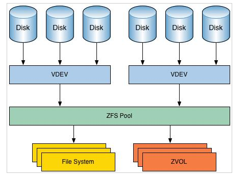
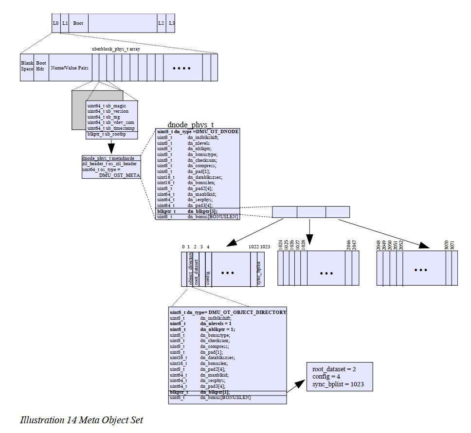

# 1. 概述

ZFS 是一个先进的文件系统。它从根本上改变了文件系统的管理方式，<span style="border-bottom:2px dashed red;">这个文件系统的特色和其带来的好处至今没有其他文件系统可以与之媲美</span>，ZFS 被设计成强大的、可升级并易于管理的。

wjt:消除volume的概念，用存储池，

# 2. 特性

- 存储池
- 写时拷贝
- 快照
- 数据完整性验证和自动修复
- RAID-Z
- 最大单个文件大小为 16 EB（1 EB = 1024 PB）
- 最大 256 千万亿（256*1015 ）的 ZB（1 ZB = 1024 EB）的存储

## 2.1. 存储池

不同于传统文件系统需要驻留于**单独设备或者需要一个卷管理系统**去使用一个以上的设备，<span style="border-bottom:2px dashed red;">ZFS创建在虚拟的，被称为“zpools”的存储池之上</span>。每个存储池由若干虚拟设备（virtual devices，vdevs）组成。这些虚拟设备可以是原始磁盘，也可能是一个RAID1镜像设备，或是非标准RAID等级的多磁盘组。于是zpool上的文件系统可以使用这些虚拟设备的总存储容量。

ZFS作为一个全新的文件系统，<span style="border-bottom:2px dashed red;">全面抛弃传统File System + Volume Manager + Storage的架构</span>（卷管理）。过去，文件系统都是构建在物理设备之上的。为了管理这些物理设备，并为数据提供冗余，“卷管理”的概念提供了一个单设备的映像。但是这种设计增加了复杂性，同时根本没法使文件系统向更高层次发展，因为文件系统不能跨越数据的物理位置。但是zfs文件系统，所有的存储设备是通过ZFS Pool进行管理，只要把各种存储设备加 入同一个ZFS Pool，大家就可以轻松的在这个ZFS Pool管理配置文件系统。


## 2.2. 写时拷贝事务模型

写时拷贝 (Copy-on-write)是另一个有趣并且很酷的特性。在大多数文件系统上，当数据被重写时，它将永久丢失。而在 ZFS 中，新数据会写到不同的块。写完成之后，更新文件系统元数据信息，使之指向新的数据块（LCTT 译注：更新之后，原数据块成为磁盘上的垃圾，需要有对应的垃圾回收机制）。这确保了如果在写新数据的时候系统崩溃（或者发生其它事，比如突然断电），那么原数据将会保存下来。这也意味着，<span style="border-bottom:2px dashed red;">在系统发生崩溃之后，不需要运行 fsck 来检查和修复文件系统。</span>

关于fsck可参考fsck章节

## 2.3. 快照与克隆

ZFS使用写时拷贝技术的一个优势在于，<span style="border-bottom:2px dashed red;">写新数据时，包含旧数据的块被保留着</span>，提供了一个可以被保留的文件系统的快照版本。由于ZFS在读写操作中已经存储了所有构建快照的数据，所以快照的创建非常快。而且由于任何文件的修改都是在文件系统和它的快照之间共享的，所以ZFS的快照也是空间优化的。
可写快照（"克隆"）也可以被创建。结果就是<span style="border-bottom:2px dashed red;">两个独立的文件系统共享一些列的块</span>。当任何一个克隆版本的文件系统被改变时，新的数据块为了反映这些改变而创建，但是不管有多少克隆版本的存在，未改变的块仍然在其他的克隆版本中共享

克隆源于快照，它们的初始内容与最初的快照相同

## 2.4. 数据完整性验证和自动修复

由于ZFS所有的数据操作都是基于Transaction（事务），一组相应的操作会被ZFS解 析为一个事务操作，事务的操作就代表着一组操作要么一起失败，要么一起成功。而且如前所说，ZFS对 所有的操作是基于COW（Copy on Write）， 从而保证设备上的数 据始终都是有效的，再也不会因为系统崩溃或者意外掉电导致数据文件的inconsistent。
还有一种潜在威胁 数据的可能是来自于硬件设备的问题，比如磁 盘，RAID卡的硬件问题或者驱动bug。现有文件系统通常遇到这个问题，往往只是简单的把错误数据直接交给上层应用，通常我们把这个问题称作Silent Data Corruption。而在ZFS中，对所有数据不管是用户数据还是文件系统自身的metadata数 据都进行256位的Checksum（校 验），当ZFS在提交数据时会进行校验，彻底杜绝这种Silent Data Corruption情况。

## 2.5. RAID-Z

`ZFS Mirror 和 RAID-Z`

传统的硬盘Mirror及RAID 4，RAID 5阵列方式都会遇到前面提到过的问题：Silent Data Corruption。如果发生了某块硬盘物理问题导致数据错误，现有的Mirror，包括RAID 4，RAID 5阵列会默默地把这个错误数据提交给上层应用。如果这个错误发生在Metadata中，则会直接导致系统的Panic。 而且还有一种更为严重的情况是：在RAID 4和RAID 5阵列中，如果系统正在计算Parity数值，并再次写入新数据和新Parity值的时候发生断电，那么整个阵列的所有存储的数据都毫无意义了。
在ZFS中则提出了相对应的ZFS Mirror和RAID-Z方式，它在负责读取数据的时候会自动和256位校验码进行校验，会主动发现这种Silent Data Corruption，然后通过相应的Mirror硬 盘或者通过RAID-Z阵列中其他硬盘得到正确的数据返回给上层应用，并且同时自动修复原硬盘的Data Corruption 。

## 2.6. 容量

ZFS是一款128bit文件系统，总容量是现有64bit文件系统的1.84x10^19倍，其支持的单个存储卷容量达到16EiB（2^64byte，即 16x1024x1024TB）；一个zpool存储池可以拥有2^64个卷，总容量最大256ZiB（2^78byte）；整个系统又可以拥有2^64个存储 池。可以说在相当长的未来时间内，ZFS几乎不太可能出现存储空间不足的问题。

在现有的64位kernel（内 核）下，它可以容纳达到16 Exabytes(264)大小的单个文件，可以使用264个存储设备，可以创建264个文件系统(暂时不明白是怎么算的？？？？）。

`zpool add zfs_pool mirror c4t0d0 c5t0d0`
基于这个动态调节的ZFS Pool之上的所有的文件系统就可以立即使用到这个新的硬盘，并且会自动的选择最优化的参数。

# 元数据


# 3. 虚拟设备（vdev)

虚拟设备分为物理虚拟设备（physical virtual devices）和逻辑虚拟设备（logical virtual devices，interior vdevs），vdev被安排在一个树中，物理vdev作为树的叶子存在。

所有的存储池都有个特殊的逻辑vedev，叫'root' vedev，这是树的root, 树的direct children（物理或者逻辑的）vdev叫做 top-level vdevs.


虚拟设备描述的是单个设备或者按特定的性能和故障特征组织的设备集合。**zpool创建存储池，支持的虚拟设备如下**：

**disk**
一种块设备，通常位于 /dev/dsk 下。ZFS 可以使用单个分片或分区，但推荐的操作模式是使用整个磁盘。可以通过全路径指定磁盘，也可以使用缩略名称（/dev/dsk 下的相对路径部分）。通过省略分片或分区部分，可以指定整个磁盘。或者，可以使用描述磁盘当前位置的 /dev/chassis/.../disk 路径指定整个磁盘。如果指定整个磁盘，ZFS 会在必要时自动为磁盘添加标签。

**file**
一种常规文件。强烈建议不要使用文件作为后备存储。它主要是为试验目的而设计的，因为文件的容错能力与其所属的文件系统相同。必须用全路径指定文件。

**mirror**
两个或更多设备的镜像。数据以完全相同的方式在一个镜像的所有组件之间进行复制。包含 N 个大小为 X 的磁盘的镜像可以存放 X 字节，并可承受 (N-1) 个设备故障而不会损害数据完整性。

**raidz**
**raidz1**
**raidz2**
**raidz3**
RAID-5 的一种变体，可以更好地分配奇偶校验，消除“RAID-5 写入漏洞”（在这种漏洞中，数据和奇偶校验会在断电后变得不一致）。数据和奇偶校验在 raidz 组内的所有磁盘间呈条带分布。

raidz 组可以有单一、双重或三重奇偶校验，即 raidz 组分别可以承受一次、两次或三次故障而不会丢失任何数据。raidz1 vdev 类型指定单一奇偶校验 raidz 组，raidz2 vdev 类型指定双重奇偶校验 raidz 组，raidz3 vdev 类型指定三重奇偶校验 raidz 组。raidz vdev 类型是 raidz1 的一个别名。

一个包含 N 个大小为 X 的 raidz 组（其中有 P 个奇偶校验磁盘）可以存放大约 (N-P)*X 字节，并可承受 P 个设备故障而不会损害数据完整性。一个 raidz 组中的设备数量至少比奇偶校验磁盘数多一个。推荐的数量在 3 到 9 个之间，这有助于提高性能。

**spare**
一种特殊的伪 vdev，可以跟踪池的可用热备件。有关更多信息，请参见“热备件”部分。

**log**
独立意图日志设备。如果指定了多个日志设备，则将在设备之间进行写负载平衡。可以镜像日志设备。但是，意图日志不支持 raidz vdev 类型。有关更多信息，请参见“意图日志”部分。

**cache**
用于高速缓存存储池数据的设备。不能将高速缓存设备配置为镜像或 raidz 组。有关更多信息，请参见“高速缓存设备”部分。

虚拟设备不能嵌套，因此镜像或 raidz 虚拟设备只能包含文件或磁盘。不允许有镜像的镜像（或其他组合）。

一个池可以在配置的顶层具有任意数目的虚拟设备，称为根 vdev。数据在所有顶层设备间动态分布，以平衡设备间的数据。添加新的虚拟设备时，ZFS 自动将数据放在新近可用的设备上。

虚拟设备在命令行上是逐次指定的，多个虚拟设备间用空格分隔。关键字 mirror 和 raidz 用于区分一个组的结束和另一个组的开始。例如，以下命令将创建两个根 vdev，其中每个根 vdev 都是两个磁盘的镜像。


### Vdev Labels:

每一块物理vdev上有256K的structure叫做vedv label，信息是所有top-level下物理盘的详细说明，以及top-level的详细说明。每块物理盘上有四份拷贝（完全相同），不同的vedev上的label有些许差异，
作用：提供对池子的访问（好像很虚）并用于验证吃的完整性和可用性


label具体信息：8k blank space, 8k boot header informaition, 112k name-kalue pairs,128k of 1k sized uberblock structures。 

# 块指针

vdev和偏移量一起惟一地标识它所指向的数据块地址
The blocks at level 0 are data blocks
Objects are defined by 512 bytes structures called **dnodes3**. A dnode describes and organizes a collection of blocks making up an objectdnode描述并组织组成对象的块的集合

# 4. 安装

## 4.1. 开箱即用

如果你想立刻使用 ZFS（开箱即用），那么你需要安装 FreeBSD 或一个 使用 illumos 内核的操作系统 。 illumos 是OpenSolaris 内核的一个克隆版本。
事实上，支持 ZFS 是一些有经验的 Linux 用户选择 BSD 的主要原因 。

## 4.2. linux上安装

[参考](https://linuxhint.com/install-zfs-centos7)

根据Linux系统版本（应该是系统内核的版本uname -r)来安装对应的zfs,分成配置yum源和yum安装两步

可以创建空洞文件来作为虚拟磁盘(原理我还不清楚？？？)

dd if=/dev/urandom of=/zfs/data1 bs=1M count=1 seek=1024

dd if=/dev/urandom of=/zfs/data2 bs=1M count=1 seek=1024

dd if=/dev/urandom of=/zfs/data3 bs=1M count=1 seek=1024

dd if=/dev/urandom of=/zfs/data4 bs=1M count=1 seek=1024

dd if=/dev/urandom of=/zfs/data5 bs=1M count=1 seek=1024

dd if=/dev/urandom of=/zfs/data6 bs=1M count=1 seek=1024

创建RAID-Z存储池

```vim
[root@localhost /]#zpool create pool-1 /zfs/data1 /zfs/data2 /zfs/data3 /zfs/data4

#查看存储池的信息
[root@localhost /]# zpool list -v
NAME           SIZE  ALLOC   FREE  CKPOINT  EXPANDSZ   FRAG    CAP  DEDUP    HEALTH  ALTROOT
pool-1        3.75G  97.5K  3.75G        -         -     0%     0%  1.00x    ONLINE  -
  /zfs/data1   960M  36.5K   960M        -         -     0%  0.00%      -  ONLINE
  /zfs/data2   960M  24.5K   960M        -         -     0%  0.00%      -  ONLINE
  /zfs/data3   960M      0   960M        -         -     0%  0.00%      -  ONLINE
  /zfs/data4   960M  36.5K   960M        -         -     0%  0.00%      -  ONLINE


[root@localhost /]# df -h
文件系统                 容量  已用  可用 已用% 挂载点
/dev/mapper/centos-root   40G  2.7G   38G    7% /
devtmpfs                 1.9G     0  1.9G    0% /dev
tmpfs                    1.9G     0  1.9G    0% /dev/shm
tmpfs                    1.9G  8.7M  1.9G    1% /run
tmpfs                    1.9G     0  1.9G    0% /sys/fs/cgroup
/dev/sda1               1014M  189M  826M   19% /boot
/dev/mapper/centos-home   20G   33M   20G    1% /home
tmpfs                    379M     0  379M    0% /run/user/0
pool-1                   3.7G  128K  3.7G    1% /pool-1          #会发现这个地方多出来一个东西
```

创建文件系统（为什么要创建文件系统，已经有了存储池，可以里面读写？？？？）

```vim
[root@localhost pool-1]# zfs create pool-1/zfs1

[root@localhost pool-1]# zfs create pool-1/zfs2

[root@localhost pool-1]# zfs create pool-1/zfs

[root@localhost pool-1]# df -h
文件系统                 容量  已用  可用 已用% 挂载点
/dev/mapper/centos-root   40G  2.7G   38G    7% /
devtmpfs                 1.9G     0  1.9G    0% /dev
tmpfs                    1.9G     0  1.9G    0% /dev/shm
tmpfs                    1.9G  8.7M  1.9G    1% /run
tmpfs                    1.9G     0  1.9G    0% /sys/fs/cgroup
/dev/sda1               1014M  189M  826M   19% /boot
/dev/mapper/centos-home   20G   33M   20G    1% /home
tmpfs                    379M     0  379M    0% /run/user/0
pool-1                   3.7G  128K  3.7G    1% /pool-1
pool-1/zfs1              3.7G  128K  3.7G    1% /pool-1/zfs1      #多出来下面三个，但是不明白容量为什么是3.7g,而不是除以3
pool-1/zfs2              3.7G  128K  3.7G    1% /pool-1/zfs2
pool-1/zfs3              3.7G  128K  3.7G    1% /pool-1/zfs3
```

# 5. 参数（属性）配置

参见[参数配置](zfs+zpool参数配置.md)

[参考](http://mac.8miu.com/thread-763641-1-1.html)

[oracle官方文档](https://docs.oracle.com/cd/E56344_01/html/E54077/makehtml-id-0.html#scrolltoc)

# 6. 说明 

单个字母的参数，带有参数的选项

- `[ ]` 方括号。括在方括号中的选项或参数是可选的。如果没有方括号，则必须指定参数。
- . . .省略号。可以为该符号前面的参数提供多个值，或者可以多次指定该参数，例如 “filename . . .”。
- | 分隔符。一次只能指定一个由该字符分隔的参数
- { }花括号。括在大括号内的选项和/或参数是相互依赖的，因此必须将大括号中的所有内容视为一个单元。

语法的例子：

`name [option(s)] [cmdarg(s)]`
其中：

```vim
name
  可执行文件的名称。

option
  − noargletter(s) 或

  − argletter< >optarg

  其中 < > 是可选空格。

    noargletter
        表示不带参数的选项的单个字母。

    argletter
        表示需要参数的选项的单个字母。

    optarg
        符合前面的 argletter 的参数（字符串）。

    cmdarg
        不是以 − 开头的或者 − 本身表示标准输入的路径名（或其他命令参数）。

```

# 7. 其他知识点汇总

## 7.1. RAIDZ

raidz是在多个磁盘上存储数据和奇偶校验的虚拟设备

传统的raid-5都存在着“写漏洞”，就是说如果raid-5的stripe在正写数据时，如果这时候电源中断，那么奇偶校验数据将跟该部分数据不同步，因此前边的写无效

## 7.2. fsck

不管你是在用Linux，UNIX还是Windows，相信大家都有过类似的体会：当系统意外断电或者非法关机，系统重起后发现文件系统有inconsistent的问题，这时 候就需要fsck或者scandisk 来修复，这段时间是非常耗时而且最后不一定能够修复成功。更糟糕的是，如果这是一台服务器需要做fsck的时候，只能offline（下线），而且现有应用往往都是大硬盘，相应fsck修 复时间也很长，这对许多使用该服务器的用户来说几乎不能忍受的。
而使用ZFS后大家可以彻底抛弃fsck这种工具，因为ZFS是一个基于COW（Copy on Write）机制的文件系统。COW是不会对硬盘上现有的文件进行重写，保证所有硬盘上的文件都是有效的。所以不会有这种inconsistent的概念，自然就不需要这种工具了。

## 7.3. mirror

镜像有两种含义，一种是说在网上内容**完全相同而且同步更新的两个或多个服务器**，除主服务器外，其余的都被称为镜像服务器，目的是为了在主服务器不能服务的时候，**不中断服务**；另一种含义是指用GHOST或HD COPY等软件**制作的一个盘的打包文件**，它可以在在将来恢复这个盘的内容，也可以很方便地把相同的内容复制到其它盘里。
所谓镜像站点，**就是把一个互联网上的网站数据镜像在本地服务器**，并保持本地服务器数据的同步更新，用户访问本地服务器即可获得远程服务器上同样的数据。 
简单来说就是和照镜子似的，能看且内容完全相同，但不是原版的。
**镜像下载**：您下载到的东西是相同的,镜像站点是不同服务器提供的下载,因为主下载点的服务器速度有限,下载人过多时下载速度会很慢,镜像下载点为了给主下载点分流用的。

当采用磁盘镜像方式时，在每次向主磁盘写入数据后，都需要将数据再写到备份磁盘上，使两个磁盘上具有完全相同的位像图。

# 8. 问题？？？？

可用在zfs通用的命令有哪些？比如fmadm acquit 或 fmadm repair

反复提到的子系统是个什么玩意