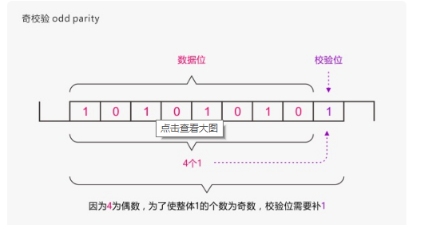
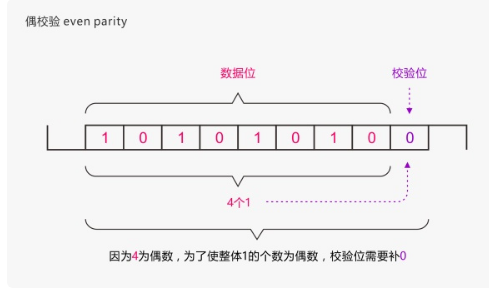

# 1. 概述
zpool 命令配置 ZFS 存储池。存储池是**一种设备集合**，<span style="border-bottom:2px dashed red;">提供 ZFS **数据集**的**物理存储和数据复制**。

存储池内的所有数据集共享同一个空间。

# 2. 虚拟设备 (vdev)

**虚拟设备**描述的是<span style="border-bottom:2px dashed red;">单个设备或者按特定的性能和故障特征组织的**设备集合**（虚拟设备可能是设备集合，存储池也是设备集合）</span>。zpool支持的虚拟设备如下：


|设备|描述|
---|---
|disk|一种块设备，通常位于 /dev/dsk 下。ZFS 可以使用单个分片或分区，但<span style="border-bottom:2px dashed red;">推荐的操作模式是使用整个磁盘</span>。【可以通过全路径指定磁盘，也可以使用缩略名称（/dev/dsk 下的相对路径部分）。通过省略分片或分区部分，可以指定整个磁盘。或者，可以使用描述磁盘当前位置的 /dev/chassis/.../disk 路径指定整个磁盘】（不是很懂这段话意思?????）。<span style="border-bottom:2px dashed red;">如果指定整个磁盘，ZFS 会在必要时自动为磁盘添加标签。|
file|一种常规文件。<span style="border-bottom:2px dashed red;">强烈建议不要使用文件作为后备存储。它主要是**为试验目的而设计**的，因为文件的容错能力与其所属的文件系统相同</span>。必须用全路径指定文件。
mirror|两个或更多设备的镜像。数据以完全相同的方式在一个镜像的所有组件之间进行复制。<span style="border-bottom:2px dashed red;">包含 N 个大小为 X 的磁盘的镜像可以存放 X 字节，并可承受 (N-1) 个设备故障而不会损害数据完整性。
raidz、raidz1、raidz2、raidz3|RAID-5 的一种变体，可以**更好地分配奇偶校验**，消除“RAID-5 **写入漏洞**”（在这种漏洞中，数据和奇偶校验会在断电后变得不一致）。【数据和奇偶校验在 raidz 组内的所有磁盘间呈条带分布】（啥意思？？？什么叫条带分布）。raidz 组可以有单一、双重或三重奇偶校验，即 raidz 组分别可以承受一次、两次或三次故障而不会丢失任何数据。raidz1 vdev 类型指定单一奇偶校验 raidz 组，raidz2 vdev 类型指定双重奇偶校验 raidz 组，raidz3 vdev 类型指定三重奇偶校验 raidz 组。**raidz vdev 类型是 raidz1 的一个别名**。<span style="border-bottom:2px dashed red;">一个包含 N 个大小为 X 的 raidz 组（其中有 P 个奇偶校验磁盘）可以存放大约 (N-P)*X 字节，并可承受 P 个设备故障而不会损害数据完整性。一个 raidz 组中的设备数量至少比奇偶校验磁盘数多一个。推荐的数量在 3 到 9 个之间，这有助于提高性能。
spare|一种特殊的伪 vdev，可以**跟踪池**的可用热备件。有关更多信息，请参见“热备件”部分。
log|独立意图日志设备。如果指定了多个日志设备，则将在设备之间进行**写负载平衡**。可以镜像日志设备。<span style="border-bottom:2px dashed red;">但是，意图日志不支持 raidz vdev 类型。有关更多信息，请参见“意图日志”部分</span>。
cache|用于高速缓存存储池数据的设备。<span style="border-bottom:2px dashed red;">不能将高速缓存设备配置为镜像或 raidz 组</span>。有关更多信息，请参见“高速缓存设备”部分。

## 2.1. 根vdev

<span style="border-bottom:2px dashed red;">一个池可以在配置的顶层具有任意数目的虚拟设备，称为根 vdev</span>。数据在所有顶层设备间动态分布，以平衡设备间的数据。添加新的虚拟设备时，ZFS 自动将数据放在新近可用的设备上。

虚拟设备在命令行上是逐次指定的，多个虚拟设备间用空格分隔。**关键字** mirror 和 raidz 用于区分一个组的结束和另一个组的开始。例如，以下命令将创建两个根 vdev，其中每个根 vdev 都是两个磁盘的镜像。

```vim
[root@localhost my-dev]# zpool create pool-1 mirror /my-dev/my_vda /my-dev/my_vdb mirror /my-dev/my_vdc /my-dev/my_vde

[root@localhost my-dev]# zpool status
  pool: pool-1
 state: ONLINE
  scan: none requested
config:

        NAME                STATE     READ WRITE CKSUM
        pool-1              ONLINE       0     0     0
          mirror-0          ONLINE       0     0     0    # 这个叫根vdev
            /my-dev/my_vda  ONLINE       0     0     0    # 这个叫虚拟设备
            /my-dev/my_vdb  ONLINE       0     0     0
          mirror-1          ONLINE       0     0     0
            /my-dev/my_vdc  ONLINE       0     0     0
            /my-dev/my_vde  ONLINE       0     0     0

errors: No known data errors


```

# 3. 池或设备故障以及恢复

ZFS 支持一套丰富的机制，用于处理设备故障和数据损坏。<span style="border-bottom:2px dashed red;">会对所有**元数据和数据进行校验和计**算，在检测到数据损坏时，ZFS 会自动根据好的副本修复坏数据</span>。可以使用`zpool status`命令查看池或者设备状态

为了利用这些功能，<span style="border-bottom:2px dashed red;">池必须采用某种形式的冗余（使用镜像组或 raidz 组）</span>。虽然 ZFS **支持在非冗余配置**下运行，但在每个根 vdev 都只是一个磁盘或文件的情况下，强烈建议不要这样做。只要出现一个数据位损坏，就会导致部分或所有数据不可用。

<span style="border-bottom:2px dashed red;">**池的运行状态**用以下四种状态之一来表示：

|状态|description|
---|---
DEGRADED|池中有一个或多个设备发生了故障，但由于有冗余配置，数据仍然可用。
ONLINE|池中的所有设备都正常运行。
SUSPENDED|池在等待设备连接恢复。在设备问题得到解决之前，挂起的池一直处于等待状态。
UNAVAIL|池中有损坏的元数据，或者有一个或多个设备不可用，并且没有足够的副本支持继续运行。

<span style="border-bottom:2px dashed red;">**顶层（根） vdev**（如镜像或 raidz 设备）的运行状况可能会受与其关联的 vdev 或组件设备状态的影响。顶层 vdev 或组件设备处于以下状态之一：

|状态|description|
---|---
DEGRADED|一个或多个顶层 vdev 处于降级状态，因为有一个或多个组件设备脱机。有足够的副本支持继续运行。一个或多个组件设备处于降级或故障状态，但有足够的副本支持继续运行。底层条件如下：1） 校验和错误的数量超出了可接受的程度，设备降级，这表明某个组件可能出现问题。ZFS 在必要时会继续使用该设备。2） I/O 错误的数量超出了可接受的程度。不能将该设备标记为故障，因为还有足够的副本支持继续运行。
OFFLINE|已通过 zpool offline 命令明确将设备置于脱机状态。
ONLINE|设备联机并正常运行。
REMOVED|系统正在运行时已物理移除了该设备。设备移除检测依赖于硬件，而且并非在所有平台上都受支持。
UNAVAIL|无法打开设备。如果在设备不可用时导入了某个池，则将用唯一标识符（而不是路径）标识该设备，因为最初的路径绝对不会正确。

如果移除设备后重新将其连接到系统，ZFS 会自动尝试将设备置于联机状态。设备连接检测依赖于硬件，而且并非在所有平台上都受支持。

# 4. 热备件

ZFS 允许<span style="border-bottom:2px dashed red;">设备以热备件的方式与池关联</span>。这些设备在池中的使用情况并不活跃，<span style="border-bottom:2px dashed red;">但在某个活动设备发生故障时，**热备件会自动替换它**</span>。要创建带热备件的池，请对任意数量的设备指定 spare vdev。例如，

```vim
[root@localhost my-dev]# zpool create pool-1 mirror /my-dev/my_vda /my-dev/my_vdb spare /my-dev/my_vdc /my-dev/my_vdd
[root@localhost my-dev]# zpool status
  pool: pool-1
 state: ONLINE
  scan: none requested
config:

        NAME                STATE     READ WRITE CKSUM
        pool-1              ONLINE       0     0     0
          mirror-0          ONLINE       0     0     0
            /my-dev/my_vda  ONLINE       0     0     0
            /my-dev/my_vdb  ONLINE       0     0     0
        spares                                            # spare 和存储池一列
          /my-dev/my_vdc    AVAIL
          /my-dev/my_vdd    AVAIL

errors: No known data errors

```

一旦启动了备件替换，将在配置中创建一个新的备件 vdev，并且该备件将保留到原始设备被替换为止。此时，如果又有另外的设备发生故障，热备件将重新变得可用。

可以使用 zpool add 命令添加备件，使用 zpool remove 命令删除备件。

通过分离热备件，可以取消正在进行的备件替换。如果分离了原始故障设备，则热备件将取代故障备件在配置中的位置，并会从所有活动池的备件列表中移除。

如果以物理方式替换了原始故障设备、使其重新联机或者清除了错误（通过 FMA 事件或者通过使用 zpool online 或 zpool clear 命令），且原始设备的状态变为正常运行，则 INUSE 备件设备将再次变为 AVAIL。

**备件不能替换日志设备。**

# 5. 意图日志

为了满足对同步事务的 POSIX 要求，提供了 ZFS 意图日志 (ZFS intent log, ZIL)。例如，数据库通常要求其事务在从系统调用中返回时应该在稳定的存储设备上。NFS 和其他应用程序也可以使用 fsync()来确保数据的稳定性。

<span style="border-bottom:2px dashed red;">缺省情况下，从主池中的块分配 ZIL。但是，通过使用单独的意图日志设备（如使用NVRAM 或专用磁盘）可能会获得更佳的性能

确定设置 ZFS 日志设备是否适合您的环境时，请注意以下几点：

■ ZFS 意图日志的日志设备与数据库日志文件无关。

■ 通过实施单独的日志设备获得的任何性能改进均取决于设备类型、池的硬件配置，以及应用程序工作负荷。有关初步性能信息，请参见以下博客：
http://blogs.oracle.com/perrin/entry/slog_blog_or_blogging_on

■ 可以取消复制或取消镜像日志设备，但日志设备不支持 RAID-Z。

■ 如果未镜像单独的日志设备，且包含日志的设备出现故障，则存储日志块将恢复至存储池。

■ 可以将日志设备作为较大存储池的一部分进行添加、替换、移除、附加、分离，以及导入和导出。

■ 可以将日志设备附加到现有日志设备，以创建镜像日志设备。此操作等同于在未镜像的存储池中附加设备。

■ 日志设备的最小大小与池中每个设备的最小大小 (64 MB) 相同。可能存储在日志设备中的相关的数据量相对较小。提交日志事务（系统调用）时将释放日志块。

■ 日志设备的最大大小应大约为物理内存大小的 1/2，因为这是可存储的最大潜在相关的数据量。例如，如果系统的物理内存为 16 GB，请考虑 8 GB 的最大日志设备大小
# 6. 高速缓存设备

# 7. 进程

每个**导入**的池都有一个关联的进程 zpool-poolname（_导入的池有，create的池有没有？？？？测试create的池并没有找到zpool相关进程）_。此进程中的线程是该池的 I/O 处理线程，<span style="border-bottom:2px dashed red;">该线程处理压缩、检验和操作以及与该池关联的所有 I/O 的其他任</span>务。此进程的目的是呈现系统存储池的 CPU 使用率信息。此进程的存在形成了一个不稳定的接口。

# 8. 属性

[参阅](zfs+zpool参数配置.md)

# 9. 子命令

# 10. 创建存储池的注意事项

创建和管理 ZFS 存储池时，请注意以下事项。

■ 请勿对属于现有存储池一部分的磁盘重新分区或重新设置标签。如果尝试对根池磁盘重新分区或重新设置标签，可能需要重新安装 OS。

■ 创建存储池时，请勿包含来自其他存储池的组件（如文件或卷）。这种配置不受支持，且会发生死锁。

■ 使用单个分片或单个磁盘创建的池没有冗余，会面临丢失数据的风险。使用多个分片创建的池如果没有冗余，也会面临丢失数据的风险。使用磁盘中多个分片创建的池比使用整个磁盘创建的池难以管理。

■ 创建时未设置 ZFS 冗余（RAID-Z 或镜像）的池只能报告数据不一致性，无法修复数据不一致性。

■ 虽然创建池时设置 ZFS 冗余有助于减少因硬件故障而导致的停机时间，但是这样的池仍不可避免地会受硬件故障、电源故障或电缆断开的影响。请确保定期备份您的数据。对非企业级硬件上的池数据定期执行备份很重要。

■ <span style="border-bottom:2px dashed red;">池不能在系统之间共享。ZFS 不是群集文件系统。

# 11. 使存储池中的设备联机和脱机

## 使设备脱机

使用 ZFS 可使单个设备脱机或联机。硬件不可靠或无法正常工作时（假定该情况只是暂
时的），ZFS 会继续对设备读写数据。如果该情况不是暂时的，<span style="border-bottom:2px dashed red;">您可以指示 ZFS 通过
使设备脱机来忽略该设备。ZFS 不会向脱机设备发送任何请求

**注 - 设备无需脱机即可进行替换**

使设备脱机时，请注意以下几点：

■ 不能将池脱机到变为 UNAVAIL 的程度。例如，不能使 raidz1 配置中的两个设备脱机，也不能使顶层虚拟设备脱机。

        # zpool offline tank c0t5000C500335F95E3d0
        cannot offline c0t5000C500335F95E3d0: no valid replicas

■ 缺省情况下，OFFLINE 状态是持久性的。重新引导系统时，设备会一直处于脱机状
态。要暂时使设备脱机，请使用 zpool offline -t 选项。例如：

      # zpool offline -t tank c1t0d0

重新引导系统时，此设备会自动恢复到 ONLINE 状态。

■ 当设备脱机时，它不会从存储池中分离出来。如果尝试使用其他池中的脱机设备，那么即使在销毁原始池之后，也会显示类似于以下内容的消息：

    device is part of exported or potentially active ZFS pool. Please see zpool(1M)

如果要在销毁原始存储池之后使用其他存储池中的脱机设备，请先使该设备恢复联机，然后销毁原始存储池。要在保留原存储池的同时使用其他存储池中的设备，还有一种方法是用另一个类似的设备替换原存储池中的现有设备。有关替换设备的信息

## 使设备联机

使设备联机时，已写入池中的任何数据都将与最新可用的设备重新同步。请注意，不能通过使设备联机替换磁盘。如果使设备脱机，然后替换该设备并尝试使其联机，则设备将一直处于 UNAVAIL 状态。

## 12.1. 奇偶校验

奇偶校验(Parity Check)是一种校验代码传输正确性的方法。根据被传输的一组二进制代码的数位中“1”的个数是奇数或偶数来进行校验。采用奇数的称为奇校验，反之，称为偶校验。采用何种校验是事先规定好的。通常专门设置一个奇偶校验位，用它使这组代码中“1”的个数为奇数或偶数。若用奇校验，则当接收端收到这组代码时，校验“1”的个数是否为奇数，从而确定传输代码的正确性。

如果传输过程中包括校验位在内的奇数个数据位发生改变，那么奇偶校验位将出错表示传输过程有错误发生。因此，奇偶校验位是一种错误检测码，但是由于没有办法确定哪一位出错，所以它**不能进行错误校正**。发生错误时必须扔掉全部的数据，然后从头开始传输数据。在噪声很多的媒介上成功传输数据可能要花费很长的时间，甚至根本无法实现。但是奇偶校验位也有它的优点，它是使用一位数据能够达到的最好的校验码，并且它仅仅需要一些异或门就能够生成。奇偶校验被广泛应用。 [1] 

通常专门设置一个奇偶校验位，用它使这组代码中"1"的个数为奇数或偶数。若用奇校验，则当接收端收到这组代码时，校验"1"的个数是否为奇数，从而确定传输代码的正确性。

奇偶校验需要一位校验位，即使用串口通信的方式2或方式3（8位数据位+1位校验位）。奇校验（odd parity）：让传输的数据（包含校验位）中1的个数为奇数。即：如果传输字节中1的个数是偶数，则校验位为“1”，奇数相反。以发送字符：10101010为例：



偶校验（even parity）：让传输的数据（包含校验位）中1的个数为偶数。即：如果传输字节中1的个数是偶数，则校验位为“0”，奇数相反。还是以发送字符：10101010为例



**优缺点：**

奇偶校验的检错率只有50%，因为只有奇数个数据位发生变化能检测到，如果偶数个数据位发生变化则无能为力了╮(╯﹏╰）╭

奇偶校验每传输一个字节都需要加一位校验位，对传输效率影响很大。

奇偶校验只能发现错误，但不能纠正错误，也就是说它只能告诉你出错了，但不能告诉你怎么出错了，一旦发现错误，只好重发。

虽然奇偶校验有很多缺点，但因为其使用起来十分简单，故目前仍被广泛使用。

应用：

如何用编程确定一个字节中“1”个数的奇偶性？我们可以利用二进制数相加的特点：

0+0=0、1+0=1、1+1=0

可以看出，如果我们将一个字节的所有位相加

有奇数个“1”的字节的和为1

有偶数个“1”的字节的和为0

由此即可通过编程完成判断。实际应用中，实现方法很多，但这是相对简单的一种，这里不再赘述。

## 12.2. LUN

**lun的全称是logical unit number，也就是逻辑单元号**。我们知道**scsi总线**上可挂接的设备数量是有限的，一般为6个或者15个，我们可以用**target ID**(也有称为**scsi id**的)来描述这些设备，**设备只要一加入系统，就有一个代号**，我们在区别设备的时候,只要说几号几号就ok了。 

而实际上我们需要用来描述的对象，是远远超过该数字的，于是我们引进了lun的概念，**也就是说lun id的作用就是扩充了target id。**每个target下都可以有多个lun device，我们通常简称lun device为lun，这样就可以说每个设备的描述就有原来的target x变成target x lun y了,那么显而易见的,我们描述设备的能力增强了.就好比,以前你给别人邮寄东西,写地址的时候,可以写: 
  
    xx市人民大街54号 xxx(收) 
    但是自从高楼大厦越来越多,你不得不这么写: 
    xx市人民大街54号xx大厦518室 xxx (收) 
    所以我们可以总结一下,lun就是我们为了使用和描述更多设备及对象而引进的一个方法而已,一点也没什么特别的地方. 

**b、lun是什么东西？** 

<span style="border-bottom:2px dashed red;">lun id不等于某个设备,只是个号码而已,不代表任何实体属性</span>,在我们的实际环境里,我们碰到的lun可能是磁盘空间,可能是磁带机,或者是media changer等等。

lun的神秘之处(相对于一些新手来说)在于，它很多时候不是什么可见的实体，而是一些虚拟的对象。比如一个阵列柜，主机那边看作是一个target device，那为了某些特殊需要，我们要将磁盘阵列柜的磁盘空间划分成若干个小的单元给主机来用，于是就产生了一些什么逻辑驱动器的说法，也就是比target device级别更低的逻辑对象，我们习惯于把这些更小的磁盘资源称之为lun0,lun1,lun2....什么的。而操作系统的机制使然，<span style="border-bottom:2px dashed red;">操作系统识别的最小存储对象级别就是lun device，这是一个逻辑对象，所以很多时候被称之为logical device。</span> 

个人理解：先确定哪个是target device,然后lun就是target低一级的单位。比如机柜是target device,那么lun就是机柜上的磁盘，lun1 lun2 之类的
